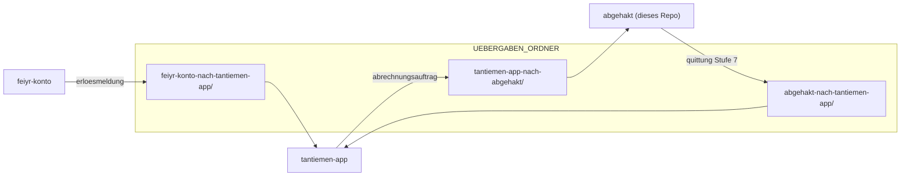

# DEV-DOCU: Entwickler-Erkenntnisse (Abgehakt)

> **Zweck und Arbeitsteilung:** Diese Datei ist die lebende Entwickler-Dokumentation für
> nicht offensichtliche **technische** Erkenntnisse, Eigenheiten von Bibliotheken,
> Reihenfolge-Zwänge, Testfolgen, Umgebungsfallen. Durchsuchbar, versioniert, im Pull
> Request nachvollziehbar.
>
> Die fachlichen „niemals brechen"-Regeln (Aufbewahrung, Statusmaschine, fail-closed) stehen
> nicht hier, sondern in [`ARCHITEKTUR.md`](ARCHITEKTUR.md). Faustregel: *warum die Software
> etwas nicht tun darf* → ARCHITEKTUR; *warum ein Werkzeug sich unerwartet verhält* → hier.

---

## Bibliotheken / Dependency-Inventur

> **Stand der Versionsprüfung:** 2026-07-23 (PyPI JSON + Maven Central
> `maven-metadata.xml`). Quelle der Wahrheit für Python-Pins:
> `backend/pyproject.toml` + `backend/uv.lock`. Image-Systemdeps: `backend/Dockerfile`. **Kein Auto-Bump**:
> jedes Update braucht Suite (`./run-tests.sh` / Compose-pytest) + bei Mustang
> die E2E-ZUGFeRD-Tests.

### Runtime (Python, `pyproject.toml`)

| Paket | Gepinnt | Neueste (PyPI) | Delta | Hinweis |
|---|---|---|---|---|
| `fastapi` | 0.115.5 | 0.139.2 | **+minor (viele)** | Routing/Deps; nach Bump Smoke + Router-Suite |
| `uvicorn[standard]` | 0.32.1 | 0.51.0 | **+minor** | ASGI-Server; mit FastAPI zusammen anheben |
| `sqlalchemy` | 2.0.36 | 2.0.51 | patch/minor 2.0.x | Relativ riskoarm in 2.0-Linie |
| `alembic` | 1.14.0 | 1.18.5 | **+minor** | Migrations-Tooling; `alembic check` ist hier ein echtes Gate (s. `ARCHITEKTUR.md`) |
| `psycopg2-binary` | 2.9.10 | 2.9.12 | patch | |
| `pydantic` | 2.10.3 | 2.13.4 | **+minor 2.x** | Settings/Models; mit `pydantic-settings` koppeln |
| `pydantic-settings` | 2.6.1 | 2.14.2 | **+minor** | |
| `jinja2` | 3.1.4 | **3.1.6** | **patch (Security)** | 3.1.5/3.1.6 schließen bekannte Template-Issues; **Priorität** |
| `python-multipart` | 0.0.20 | 0.0.32 | patch | Form-Uploads |
| `aiofiles` | 24.1.0 | 25.1.0 | **Major-Jahr** | API meist kompatibel; kurz prüfen |
| `reportlab` | 4.2.5 | **5.0.0** | **Major** | PDF-Pipeline + Font-/Table-Quirks; **nicht leichtfertig**, Branding-Tests |
| `pypdf` | 5.1.0 | **6.14.2** | **Major** | Font-Embedding-Asserts in Tests können brechen |
| `aiosmtplib` | 3.0.2 | **5.1.2** | **Major (2 Sprünge)** | DATEV-Mail-Pfad; Breaking Changes wahrscheinlich |
| `httpx` | 0.28.1 | 0.28.1 | aktuell | Update-Pruefung (`services/update_check.py`) |
| `python-dotenv` | 1.0.1 | 1.2.2 | minor | |
| `cryptography` | 44.0.0 | **49.0.0** | **Major** | Fernet/`SECRET_KEY` (Settings); OpenSSL-Bindings, vorsichtig |
| `defusedxml` | 0.7.1 | 0.7.1 | aktuell | Pflicht für fremde/eingehende XML |
| `pytest` | 8.3.4 | **9.1.1** | **Major** | Nur Test-Runner, aber Plugin-/Config-Brüche möglich |

### Dev-only: entfallen (#105 Phase 1)

`requirements-dev.txt` mit `hypothesis` und `mutmut` ist gelöscht. Beide waren im
Container nie installiert und werden von keinem Test importiert. **Mutation-Testing und
Property-Based-Testing finden in diesem Repo nicht statt**, der manuelle
Break-and-Revert-Harness von 2026-07-08 ist kein Ersatz, sein eigenes Kopf-Caveat hält
fest, dass er Guards, Finalize-Gate und Item-Cascade nicht abdeckte, also genau die
Stellen, an denen #98 später die echten Löcher fand. Die Lücken sind offen dokumentiert:
#116 (Mutation-Testing, inkl. Diagnose des mutmut-3.2-Discovery-Fehlers und
Zuschnittvorschlag) und #117 (Property-Based-Testing, inkl. Kandidatenliste und der
Unverträglichkeit mit der funktions-scoped `pg_session`-Fixture).

### Image / System (nicht in pip)

| Komponente | Gepinnt / Bezug | Neueste bekannt | Delta | Hinweis |
|---|---|---|---|---|
| **Mustang CLI** | `Dockerfile` → `ARG MUSTANG_VERSION` + `MUSTANG_SHA256` (aktuell 2.24.0) | 2.24.0 | aktuell | Upgrade = Nummer **und** SHA-256 im Dockerfile, Rebuild, volle Mustang-E2E (`test_finalize_e2e`, Schema, Storno). CLI-Flags (`--format zf`, `--no-additional-attachments`) vorab gegen die Release notes prüfen. Rezept + Fallstricke: unten. |
| Python-Basis | `python:3.11-slim` | 3.11 weiterhin; 3.12/3.13 verfügbar | Image-Tag floatet Patch | Major-Python-Sprung separat entscheiden |
| PostgreSQL | `postgres:16-alpine` | 16.x (Tag floatet) | Patch via Image-Pull | Major 17 = eigene Migration |
| Ghostscript | apt `ghostscript=10.05.1~dfsg-1+deb13u1` | n/a | Pin | PDF/A-3-Pfad; beim nächsten Debian-Point-Release laut brechen (zusammen mit Base-Digest anheben) |
| JRE | apt `default-jre-headless=2:1.21-76` | n/a | Pin | nur für Mustang; beim nächsten Debian-Point-Release laut brechen |
| DB-Backup-Image | `prodrigestivill/postgres-backup-local:16-alpine` | an PG 16 gekoppelt | | |

### Frontend (im Image, seit 2026-08-08 kein CDN mehr)

| Datei unter `app/static/` | Bezugsquelle beim Einpflegen | Lizenz |
|---|---|---|
| `js/tailwind-play-3.4.17.js` | `cdn.tailwindcss.com` (Play-CDN-Bündel) | MIT |
| `js/alpine-3.15.12.min.js` | jsDelivr, `alpinejs@3.15.12` | MIT |
| `fonts/*.woff2` (4 Familien, latin + latin-ext) | Bunny Fonts | OFL-1.1 |

Die Version steht im Dateinamen, die Lizenzen liegen daneben (`js/LIZENZEN.txt`,
`fonts/OFL.txt`). Gate: `tests/test_oberflaeche_lokal.py` fällt um, sobald eine Vorlage
wieder von einem fremden Host lädt oder ein Verweis ins Leere zeigt.

### Empfohlene Upgrade-Reihenfolge (wenn angefasst)

1. **Security-Patches zuerst:** `jinja2→3.1.6` (und bei Bedarf `cryptography` nur nach Crypto-Tests).
2. **Patch/Minor in 2.0-Linie:** `sqlalchemy`, `psycopg2-binary`, `httpx` bleibt.
3. **Mustang `2.23.1` oder `2.24.0`:** eigener PR, Image-Rebuild, alle ZUGFeRD-E2E + Validate-Asserts (`XML:valid` / Schematron). 2.24 = Spektrum-Sprung (ZF 2.5), fachlich prüfen, nicht nur „neuere Zahl“.
4. **App-Stack gekoppelt:** `fastapi` + `uvicorn` + `pydantic`/`pydantic-settings`.
5. **Major-Risiko separat:** `reportlab 5`, `pypdf 6`, `aiosmtplib 5`, `pytest 9`, je eigener PR mit gezielter Suite.
6. **Frontend-Bündel:** Datei unter `app/static/js/` austauschen, Version im Dateinamen und in
   `base.html` nachziehen, `LIZENZEN.txt` anpassen, `tests/test_oberflaeche_lokal.py` mitziehen.

Nach jedem Pin-Bump: `backend/pyproject.toml` → `./uv.sh lock` → Image rebuild → `./run-tests.sh` (baut sich alles selbst) bzw. `docker compose exec -T app python -m pytest tests/ < /dev/null` gegen den **Entwicklungsstack** (siehe „Auslieferung und Entwicklung").

---

## Dependency-Update-Prozess (Phase 1 umgesetzt: Issue #105)

> **Status:** Phase 1 umgesetzt (Branch `feat/105-phase1-uv-foundation`, Stand 2026-07-26).
> Leitziel weiterhin gültig: **ein Update darf nicht „tausende Sicherheitslücken
> aufreißen"**, Updates gezielt, reproduzierbar, review-bar, **eine Risiko-Klasse pro PR**.
> **Quelle der Wahrheit:** `backend/uv.lock` (alle transitiven Versionen + SHA-256),
> `backend/pyproject.toml` (direkte Pins). `requirements.txt` und `requirements-dev.txt`
> sind entfallen.

### Warum uv (das *eine* belegte Argument)

`uv` **hält gepinnte Versionen beim Re-Lock standardmäßig fest**, ein `uv lock` ohne Flag
floatet **nichts**. Ein Update ist immer explizit:

```bash
uv lock --upgrade-package jinja2      # NUR jinja2 anheben, Rest eingefroren
uv lock --upgrade                     # bewusster Voll-Refresh (selten, eigener PR)
```

Genau das kann `pip install -r requirements.txt` im Dockerfile **nicht** garantieren: Ein
frischer Build zieht transitive Deps floatend nach → der Mechanismus, über den ein einzelner
Rebuild still Dutzende geänderte Pakete (und CVEs) einschleppt. Ein committetes `uv.lock`, aus
dem der Build via `uv sync --locked` installiert, schließt diese Lücke. (`--frozen` prüft den
Lock **nie** gegen `pyproject.toml` und installiert bei Drift still die alte Auflösung.)

- ⚠️ **`uv.lock` ist proprietäres TOML, NICHT requirements.txt.** Nur `uv pip compile` gibt
  requirements.txt aus (pip-tools-Kompatmodus). Wir nutzen den **Projekt-Modus** (`uv.lock`),
  keinen Dual-Track, zwei Lock-Formate parallel lohnen nicht und driften.
- ⚠️ Randfall (offener uv-Bug #18681, Stand 07/2026): Ändert sich der **Wheel-Build-Tag** bei
  *gleicher* Version, kann `uv.lock` trotzdem umgeschrieben werden. Kein Blocker, aber ein
  Lock-Diff ohne Versionsänderung ist nicht zwingend ein Fehler.

### Ziel-Dateilayout

```
backend/
├── pyproject.toml     # Runtime-Deps (= heutige requirements.txt-Pins)
│                      #  + [dependency-groups] test (= nur pytest)
├── uv.lock            # eingefroren; QUELLE DER WAHRHEIT für alle Python-Pins
└── Dockerfile         # uv sync --locked --no-group test  (Prod ohne Test-Deps)
```

- **Runtime vs. Test getrennt:** `[project].dependencies` = Runtime, `[dependency-groups].test`
  = nur pytest. Prod-Image installiert `--no-group test`; `run-tests.sh` / Test-Image
  synct **inkl.** Test-Gruppe.
- `requirements.txt` / `requirements-dev.txt` / `requirements.lock` **entfallen** (Phase 1, Issue #105, Umsetzung auf Branch `feat/105-phase1-uv-foundation`).

### Nicht-PyPI-Artefakte: manuell pinnen (Standard-Tooling deckt sie NICHT ab)

Die gesamte uv/Renovate/Trivy-Kette ist PyPI-zentriert. Zwei Artefakte brauchen Extra-Behandlung:

- **Mustang-CLI JAR:** `ARG MUSTANG_VERSION` + `ARG MUSTANG_SHA256` im Dockerfile, verifiziert
  per `echo "${MUSTANG_SHA256}  /app/lib/Mustang-CLI.jar" | sha256sum -c -`. Renovate kann eine
  JAR-Download-URL nicht tracken → Update-Pfad ist ein **dokumentierter manueller Check** gegen
  Maven Central (`org.mustangproject:Mustang-CLI`, `maven-metadata.xml`), eigener PR, volle
  ZUGFeRD-E2E-Suite. Fachlich prüfen, nicht nur „neuere Zahl". Siehe Bump-Rezept unten.
- **Docker-Base-Image:** `FROM python:3.11.x-slim@sha256:...` **per Digest** pinnen (nicht nur
  Tag). Das macht die CVE-Zahl im Scan **stabil und review-bar** statt bei jedem Rebuild zu
  driften. Renovates **Docker-Manager kann Digest-Pins bumpen**, der eine Fall, wo Automation
  die non-PyPI-Lücke schließt. Trivy scannt dann exakt diesen gepinnten Layer.

### Mustang-JAR bumpen: Rezept und die zwei Fallstricke (2026-07-26, 2.23.0 → 2.24.0)

```bash
V=2.24.0; B="https://repo1.maven.org/maven2/org/mustangproject/Mustang-CLI/$V/Mustang-CLI-$V.jar"
curl -fsSL "$B" -o m.jar
shasum -a 256 m.jar          # -> ARG MUSTANG_SHA256
shasum -a 1   m.jar          # muss sich mit "$B.sha1" decken
curl -fsSL "$B.asc" -o m.jar.asc && gpg --verify m.jar.asc m.jar
```
Danach beide `ARG`-Zeilen im Dockerfile setzen und `./run-tests.sh` fahren. Zur Gegenkontrolle,
dass wirklich die neue JAR im Image liegt (ein gecachter Layer sieht identisch grün aus):
`docker run --rm --entrypoint sha256sum abgehakt-backend:test /app/lib/Mustang-CLI.jar`.

**Fallstrick 1: Maven Central publiziert für dieses Artefakt KEIN `.sha256`.** Nur `.sha1` und
`.md5`; `.sha256`/`.sha512` liefern HTTP 404. Der SHA-256 im Dockerfile ist deshalb
**Trust-on-First-Use**: selbst über die geladenen Bytes gebildet, gegen den publizierten `.sha1`
und die GPG-Signatur gegengeprüft. Das Akzeptanzkriterium „SHA-256-Verifikation" aus #105 ist
wörtlich nicht erfüllbar und wird so umgedeutet.

**Fallstrick 2: der Signaturschlüssel wurde zwischen 2.23.0 und 2.23.1 gewechselt.**
Alt: `68F4 2269 … B596 66A3` (DSA-1024, 2009, abgelaufen). Neu ab 2.23.1:
`C513 CD93 … 4DB7 4319` (RSA-3072, erstellt 2026-05-13), gleiche Kennung
`Jochen Stärk <jstaerk@usegroup.de>`. **Der neue Schlüssel trägt nur Selbstsignaturen**, der
alte hat ihn NICHT beglaubigt, es gibt also keine kryptografische Brücke. Die Rotation ist
trotzdem belegt: Die Release-Notes zu 2.23.0 kündigen sie wörtlich an („I will try to renew my
expired GPG key in the next maven central release"), und der neue Schlüssel taucht genau in der
angekündigten Folgeversion auf. Wer künftig bumpt und einen erneuten Schlüsselwechsel sieht:
**nicht durchwinken**, Release-Notes gegenlesen, UID vergleichen, und im Zweifel fragen. Der
praktische Vertrauensanker ist ohnehin nicht die Signatur, sondern die Kontrolle über den
Maven-Central-Namensraum `org.mustangproject` (von Sonatype verifiziert) plus unser Hash-Pin.

⚠️ **Keyserver-Zugriff:** `gpg --recv-keys` scheitert hier („No route to host"); über HTTPS geht
es: `curl -fsSL "https://keyserver.ubuntu.com/pks/lookup?op=get&search=0x<FPR>" | gpg --import`.

### Security-Scanning (Phase 1.5, zuerst nur reporten)

- **Trivy** (Container): OS-Pakete (Debian/Alpine) **und** Sprach-Deps (pip/maven), deckt
  Base-Image + JRE-Layer ab, die eigentliche Quelle der „tausenden CVEs".
- **pip-audit** (App-Ebene): Python-Deps gegen Advisory-DB.
- Beide zunächst **nicht-blockierend** (Sichtbarkeit), erst in Phase 3 als Gate ab Severity HIGH.

### Update-Politik (Doku, noch kein Bot in Phase 1)

- **Eine PR = eine Risiko-Klasse:** Security-Patch | Minor-Stack (gekoppelt) | Mustang | Major
  (je einzeln). Reihenfolge s. „Empfohlene Upgrade-Reihenfolge" oben.
- Nach jeder Lock-Änderung: **Image rebuild + kanonische Suite** (`./run-tests.sh`), bei Mustang
  zusätzlich die ZUGFeRD-E2E.
- CI-Gate: **`uv lock --check`** vor der Suite (schlägt fehl, wenn `pyproject.toml` und `uv.lock`
  divergieren, verhindert „vergessenes Re-Lock"). Anders als `alembic check` ist das ein
  **echtes** Gate.

### Betriebsregeln uv (seit #105 Phase 1)

- uv-Version und `uv.lock` werden **im selben Commit** angehoben. Ein uv-Bump ohne
  Lock-Regenerierung ist die einzige belegte Quelle für Format-Revisions-Drift.
- Die uv- und Base-Image-Digests stehen an **zwei** Stellen: `backend/Dockerfile` und
  `backend/uv.sh`. Beide müssen gemeinsam wandern, sonst lockt der Wrapper mit einer
  anderen uv-Version, als der Build prüft.
- `uv.lock` nie von Hand editieren, nie gegen einen privaten Mirror erzeugen.
- Schlägt das `--locked`-Gate an: regenerieren, Diff ansehen, committen. Nicht mit
  `--frozen` umgehen.
- `uv lock --check` prüft NUR pyproject↔Lock, nicht die Verfügbarkeit der Artefakte.
  Nach dem Löschen eines gelockten Wheels bleibt `--check` bei rc=0, während
  `uv sync --locked` abbricht. Das echte Gate ist deshalb `uv sync --locked` im Build.
- Der Cache-Mount im Dockerfile setzt BuildKit voraus (Default seit Docker Engine 23).
  Bei `DOCKER_BUILDKIT=0` bricht der Build mit einer klaren Meldung ab.

Das offizielle uv-Image ist **distroless und enthält kein Python**. `docker run --rm -v … ghcr.io/astral-sh/uv:0.11.32 lock` bricht deshalb mit „Failed to discover managed Python installations" ab, **und zwar mit rc=0 und ohne Lockdatei**, also still. Genau dafür existiert `backend/uv.sh`: Es zieht die uv-Binary aus dem gepinnten Image und führt sie in `python:3.11-slim` aus. Immer `./uv.sh` benutzen, nie den Direktaufruf.

### Automation = Phase 2 (Renovate): mit einer offenen Verifikation

Renovate `packageRules` (Regex, Pfad, `matchUpdateTypes`, Auto-Merge nach CI) schlagen
Dependabot `groups` für die „eine Risiko-Klasse pro PR"-Politik, **das** ist der Grund für
Renovate, nicht Speed/Onboarding (beide Marketing-Claims in der Recherche widerlegt).

⚠️ **Vor Phase 2 zwingend empirisch klären** (durch die Recherche NICHT belegt; die Aussage
„Renovate hat nativen uv.lock-Support" wurde 0-3 widerlegt): Ob der gewählte Bot `uv.lock`
tatsächlich liest und unter Erhalt der „pinned-by-default"-Semantik bumpt. An einem Test-Repo
prüfen, nicht annehmen. Ebenso: löst Renovate einen Docker-**Digest**-Bump bei Security-Patch
am gleichen Tag aus, und erkennt Trivy CVEs am digest-gepinnten Layer.

---

## E-Rechnung / ZUGFeRD

### `BR-CO-26`: eine Steuernummer allein macht keine gueltige E-Rechnung (2026-08-09)

Gefunden in der Abnahme, an einer echten Erstinstallation, nicht in der Suite. Die
Einrichtung laesst „Steuernummer **oder** USt-IdNr." zu, weil § 14 UStG das so
vorsieht. EN 16931 verlangt darueber hinaus ueber `BR-CO-26` mindestens eines von
**BT-29** (Verkaeufer-Kennung), **BT-30** (Registernummer) oder **BT-31**
(USt-IdNr.). Die Steuernummer geht als **BT-32** ins Dokument und zaehlt dafuer
**nicht**. Folge vor dem Fix: wer keine USt-IdNr. hat, konnte alles korrekt
ausfuellen und **keine einzige Rechnung finalisieren**.

Gemessen (Mustang, EN16931-Profil): nur Steuernummer ⇒ `XML:invalid`; mit USt-IdNr.
⇒ `XML:valid`; nur Steuernummer, diese zusaetzlich als BT-29 ⇒ `XML:valid`.
`zugferd_xml._seller_id_xml` gibt sie deshalb als BT-29 aus, **nur** wenn die
USt-IdNr. fehlt. BT-29 ist das erste Kind von `SellerTradeParty` (die CII-Sequenz
ist geordnet: ID, GlobalID, Name, …); nach dem Namen waere es ein Schemafehler.

**Warum 673 gruene Tests das nicht gesehen haben:** die Firma in
`test_zugferd_xml_schema.py::_company` traegt immer **beides**. Der Fall „nur
Steuernummer" existierte nur in `test_zugferd_xml.py` als Zeichenketten-Test, und
Zeichenketten sehen keine Schematron-Regel. Merke: **jede Feldkombination, die die
Einrichtung zulaesst, braucht einen Mustang-Lauf**, nicht nur einen String-Test.
Regressionstest: `test_verkaeufer_nur_mit_steuernummer_ist_gueltig`.

Zweite Haelfte desselben Fundes: die Fehlermeldung beim Finalisieren nannte nur
„PDF/A- oder Mustang-Schritt fehlgeschlagen". Der Grund steht jetzt drin
(`pruefgrund`, erster Eintrag aus `result["errors"]`, auf 400 Zeichen gekuerzt):
ohne ihn bleibt nur „nochmal versuchen", und der zweite Versuch scheitert an
derselben Regel.

### Mustang ist die Wahrheit: nicht `combine`-rc, nicht der Dateiname (#98 E1/E3, PR #102)

`mustang.combine` liefert `True` (rc=0 + Datei existiert) auch für ein PDF, das ein
Empfänger-/Prüfer-System ablehnen würde. Deshalb reicht `combine==True` NICHT:

- **Finalize (E1):** nach erfolgreichem `combine` validiert der Router
  (`routers/invoices.py`) das kombinierte PDF via `mustang.validate(zugferd_pdf)` und macht
  `issued` **nur bei `result["is_valid"] and "XML:valid" in result["raw"]`**, sonst
  fail-closed (bleibt `draft`, 400, Zwischen-PDFs entfernt, `db.rollback()`). `is_valid`
  ALLEIN genügt nicht: ein bares PDF/A ohne eingebettete XML kann fehlerfrei sein, trägt
  aber kein `XML:valid` → die String-Klausel ist der eigentliche E-Rechnungs-Beweis.
- **DATEV-Send (E3):** vor dem SMTP-Versand `mustang.validate(pdf_path)` (gleiche
  Bedingung); der `_visual`-Suffix-Check bleibt nur billige Vorabprüfung. Ohne Mustang
  (`jar_available()` False) wird NICHT gesendet (fail-closed), da die Einbettung nicht
  beweisbar ist.
- ⚠️ **Testfolge:** JEDER Finalize/Send-Test, der die Pipeline auf Erfolg mockt, muss
  zusätzlich `mustang.validate` mocken (`{"is_valid": True, "raw": "…XML:valid…"}`), sonst
  läuft der echte Validator gegen das Fake-PDF und fail-closed'et zu `400`. Vorbild:
  `_valid_mustang()` in `test_finalize_fail_closed.py` / `test_datev_send.py`,
  `_finalize_with_fake_pipeline` in `test_finalize_validation_gate.py`. Tests:
  `test_finalize_blocks_when_combined_pdf_*`, `test_send_refuses_pdf_without_embedded_xml`,
  `test_send_allows_real_zugferd_pdf`.

### Zeitgrenze der Subprozesse: ein Fehlschlag, kein Absturz (2026-08-10)

`subprocess.run(..., timeout=…)` wirft `TimeoutExpired` - eine Ausnahme, kein Rückgabewert.
Ungefangen fliegt sie in `services/mustang.py` (60 s) und `services/pdfa.py` (120 s) am
gesamten fail-closed-Weg im Finalisieren **vorbei**: kein `unlink` der Zwischen-PDFs, kein
`db.rollback()`, ein 500er statt eines Satzes. Übrig bleibt eine verwaiste PDF mit echter
Rechnungsnummer in `storage/pdfs/`, im GoBD-Archiv später nicht mehr von einem Beleg zu
unterscheiden. Beide Stellen fangen die Ausnahme deshalb ab und melden sie als gewöhnlichen
Fehlschlag (`combine` → `False`, `validate` → `is_valid False` mit `[error]`-Marker, damit
auch `_no_errors` greift).

Aufgefallen ist das nicht im Betrieb, sondern in der eigenen Suite: `test_kontaktdaten_und_
referenz.py::test_die_erweiterte_rechnung_bleibt_schema_gueltig` fiel **einmal** um, während
parallel ein Image gebaut wurde (Lauf 1675 s statt 310 s), und war isoliert sofort wieder
grün. Ein Test, der nur unter Last umfällt, ist hier kein Flake zum Wegdrücken, sondern der
Hinweis auf eine JVM, die über ihre Zeitgrenze läuft - und die Zielgruppe betreibt das
Programm auf betagten Rechnern und NAS-Geräten, nicht auf Entwicklermaschinen.
Tests: `test_mustang.py::test_*_zeitgrenze_*`, `test_pdfa.py::test_to_pdfa3_meldet_die_
zeitgrenze_*`, `test_finalize_fail_closed.py::test_finalize_bleibt_entwurf_wenn_mustang_in_
die_zeitgrenze_laeuft`.

### Extract-Roundtrip: Inhalt ≡ `zugferd_xml` prüfen, nicht Root-Substring (#98 E2)

`test_extract_xml_roundtrip` prüfte früher nur `"CrossIndustryInvoice" in out_xml`, das
bleibt grün, selbst wenn `combine`/`extract` den Payload vertauschen, kürzen oder Werte
verfälschen würden (jede Factur-X-XML enthält den Root-Namen). E2 assertet jetzt
**Inhaltsgleichheit** der extrahierten XML mit dem eingebetteten `zugferd_xml`.

- **Kein Byte-Vergleich:** Mustang darf beim `combine` reserialisieren (XML-Deklaration,
  Whitespace/Pretty-Print, Namespace-Präfixe), Byte-Gleichheit wäre spröde und würde
  fälschlich rot. Stattdessen: beide XML mit **`defusedxml`** parsen (Roundtrip-XML ist
  effektiv „empfangene" E-Rechnung → nie stdlib `xml.etree`, s. u.) und die **normalisierten
  Element-Bäume** vergleichen: `(tag inkl. {uri}local, sortierte Attribute, getrimmter
  `.text`, Kinder in Reihenfolge)`. `.tail` (Einrückung) wird ignoriert; ElementTree löst
  Präfixe zu `{uri}local` auf → Präfix-Unterschiede fallen weg, echte Wert-/Struktur-/
  Reihenfolge-Abweichungen brechen. Helper `_content_tree` in `test_mustang.py`.
- ⚠️ **`ET.fromstring(str)` mit Encoding-Deklaration wirft `ValueError`** („Unicode strings
  with encoding declaration are not supported"). `generate_xml` liefert einen `str` MIT
  `<?xml … encoding="UTF-8"?>` → vor dem Parsen `.encode("utf-8")` (Bytes), bzw. die
  extrahierte Datei per `read_bytes()` lesen. Nie den `str` direkt an `fromstring` geben.
- **Zähne (Break-and-Revert 2026-07-23):** eine einzige geänderte Betragssumme im
  Vergleichs-Quelltext ⇒ ROT. Der alte Substring-Check wäre grün geblieben.

### MINIMUM/BASIC-WL hart ablehnen: kein stiller Profil-Fallback (#98 E4)

`generate_xml` mappte ein unbekanntes/nicht-konformes `zugferd_profile` per
`PROFILE_IDS.get(profile, PROFILE_IDS["EN16931"])` **still auf die EN16931-ID**, d. h. eine
MINIMUM-/BASIC-WL-Rechnung (rechtlich KEINE gültige E-Rechnung, § 14 UStG verlangt mind.
EN16931) hätte eine XML mit **EN16931-Profil-ID über nicht-konformem Inhalt** getragen. Der
alte `test_unknown_profile_falls_back_to_en16931` zementierte genau diesen Fehler.

Fix als **Defense-in-depth** (fail-closed auf zwei Ebenen):
- **`validator.validate_invoice`** meldet `PROFILE_NOT_COMPLIANT` (error) für jedes Profil
  außerhalb `COMPLIANT_PROFILES` (= `PROFILE_IDS`-Keys: EN16931/BASIC/XRECHNUNG). Dadurch
  greift das **Finalize-Gate** und liefert einen sauberen **400** (nicht 500), ein
  MINIMUM-Draft wandert nie ins Archiv.
- **`generate_xml`** wirft zusätzlich `NonCompliantProfileError` statt still zu mappen.
  Letzte Verteidigungslinie, damit **kein** Codepfad (Finalisieren, Storno, künftige) je eine
  mislabelte XML erzeugt.
- **`None`/leer = Modell-Default:** die Spalte `zugferd_profile` ist `nullable=False,
  default="EN16931"`, ein PERSISTIERTER Beleg ist nie None, nur in-memory (unflushed)
  Objekte. Deshalb `profile = invoice.zugferd_profile or "EN16931"` VOR der Allowlist-Prüfung
  (in `generate_xml` UND `validator`): None ⇒ EN16931 (legal), nur ein EXPLIZIT nicht-
  konformes Profil wird abgelehnt. Ohne diese Normalisierung schlugen 16 Alt-Tests fehl, die
  minimale Invoices mit `zugferd_profile=None` bauen und `generate_xml` direkt aufrufen, ein
  echtes False-RED-Risiko, das erst der VOLLE Suite-Lauf (nicht der Einzelfile-Lauf) zeigte.
- ⚠️ **Testfolge:** Der Validator liest jetzt `invoice.zugferd_profile`. `SimpleNamespace`-
  `_invoice()`-Fabriken in `test_validator.py` müssen das Feld setzen (Default `"EN16931"`),
  sonst `AttributeError`. Tests: `test_validator.py::test_profile_*`,
  `test_zugferd_xml.py::test_generate_xml_rejects_*`,
  `test_finalize_validation_gate.py::test_finalize_blocked_for_non_compliant_profile`.
- **Zähne (Break-and-Revert):** alter `.get(default)`-Fallback wieder eingesetzt ⇒
  `test_generate_xml_rejects_*` ROT; Validator-Regel entfernt ⇒ `test_profile_*` ROT.

### PDF↔XML-Betragskonsistenz cross-prüfen (#98 E6)

PDF- und XML-Tests prüften bisher jeweils NUR ihre eigene Seite, eine Divergenz zwischen
dem visuellen PDF und der (rechtlich maßgeblichen) ZUGFeRD-XML fiel durch (§ 14c-Risiko:
unzutreffender Steuerausweis). `test_pdf_xml_consistency.py` erzeugt beide aus DERSELBEN
Rechnung und stellt sicher, dass die XML-Summen (Netto/Steuer/Brutto) auch im PDF stehen.

- **Divergenzfläche (nicht offensichtlich):** der PDF-Steuerbetrag wird pro Steuersatz aus
  den Positionen SUMMIERT (`tax_groups[rate]["tax"] += item.tax_amount`), die XML
  `TaxTotalAmount` nutzt `invoice.tax_total`. Weichen die auseinander, zeigen PDF und XML
  verschiedene Steuer.
- **Robuste Betrags-Extraktion:** PDF-Text (pypdf) → Regex `(?<!\d)(\d{1,3}(?:\.\d{3})*|\d+),(\d{2})(?!\d)`
  → Set von `Decimal`. Die Lookarounds verhindern Teilstring-Treffer (`57,02` matcht NICHT in
  `357,02`). Testbeträge bewusst mit UNTERSCHIEDLICHEN Cent-Endungen (300,11 / 57,02 / 357,13),
  damit kein Betrag Teilstring eines anderen ist. XML-Summen via `defusedxml` +
  `SpecifiedTradeSettlementHeaderMonetarySummation`. Kein Mustang/Ghostscript nötig.
- **Zähne (Break-and-Revert):** PDF-`_money(invoice.gross_total)` → `* 2` ⇒ Brutto fehlt im
  PDF-Set ⇒ ROT.

### Struktur/Reihenfolge gehört in den Mustang-Schema-Test, nicht in Substring/XPath (#98 E5)

`test_zugferd_xml.py` (58 Tests) prüft fachliche **WERTE** per XPath, aber XPath-`find()` ist
**ordnungsblind** und ein Substring-Match sieht keine Sequenzfehler. Der reale
PostcodeCode-vor-LineOne-Bug (Mustang type 18) blieb dort unsichtbar. Die einzige harte
Strukturprüfung ist `test_zugferd_xml_schema.py` (Mustang/XSD, `is_valid`).

- **Aufteilung zementiert:** `test_zugferd_xml.py` = Werte (TypeCode, Kategorie, Beträge,
  schemeID, Aggregations-Counts, was das Schema NICHT prüft). `test_zugferd_xml_schema.py`
  = Struktur/Reihenfolge/Namespaces/Datentypen. **Keine neuen Struktur-Tests in die
  XPath-Datei** (falsche Sicherheit), Modul-Docstring dort warnt explizit.
- **Getan:** `test_xml_is_valid_and_parseable` (nur `root.tag.endswith(...)`) entfernt:
  reiner Parse-Check = falsche „gültig"-Sicherheit, vom Schema-Test real abgedeckt. NICHT
  mass-gelöscht: die 57 verbleibenden sind Wert-Asserts (echte Coverage, die das Schema nicht
  leistet). `test_postcode_precedes_lineone_in_all_addresses` BLEIBT, reine-Python-Ordnungs-
  prüfung, läuft auch **ohne** Mustang-JAR (der Schema-Test `skipif`t dann).
- **Zähne (Break-and-Revert):** PostcodeCode/LineOne im Seller-Block getauscht ⇒ **15
  Schema-Tests + der Ordnungstest ROT**, während alle 57 XPath-Wert-Tests GRÜN blieben, der
  Beweis, dass der Schema-Test die Strukturprüfung ist, nicht die Substring/XPath-Tests.

---

### Die PDF-Kette: sichtbares PDF → PDF/A-3 (Ghostscript) → `combine`

Drei nicht offensichtliche Voraussetzungen, alle empirisch geklärt, vorher schlug der Ablauf
**still** fehl:

1. **`mustang combine` ist ohne Flags interaktiv und meldet falschen Erfolg.** Es fragt auf
   stdin nach Anhängen und Format; ohne stdin wirft es eine `NullPointerException`, schreibt
   **keine** Ausgabedatei, und beendet sich mit **rc=0**. Deshalb übergibt `combine()`
   `--format zf --no-additional-attachments` und prüft den Erfolg an
   `rc == 0 **und** out_path.exists()`, nie am Rückgabewert allein.
2. **`combine` verlangt ein PDF/A als Eingabe.** Der Exporter liest `pdfaid:part` aus dem XMP;
   ein normales ReportLab-PDF, auch mit eingebetteten Schriften, endet mit
   `IllegalArgumentException: PDF-A version not supported`. Schrifteinbettung ist für PDF/A
   nötig, aber **nicht hinreichend**: es fehlen XMP-Metadaten und der sRGB-OutputIntent.
   `services/pdfa.py::to_pdfa3()` hebt das PDF deshalb über Ghostscript auf PDF/A-3
   (`-dPDFA=3 -sColorConversionStrategy=RGB -dPDFACompatibilityPolicy=1` plus eine PDFA_def.ps
   mit sRGB-Profil aus dem Ghostscript-Paket, nicht mitgeliefert).
3. **Reihenfolge im Finalisieren:** sichtbares PDF → `pdfa.to_pdfa3` → `mustang.combine`.

**Ein blankes PDF/A prüfen:** `mustang.validate(pdf_ohne_xml)["raw"]` enthält bei gültigem
PDF/A `isCompliant=true`, aber **nicht** `Parsed PDF:valid`, das erscheint erst mit
eingebetteter XML, und `is_valid` ist ohne sie trotzdem `False`. Für den Nachweis von Ende zu
Ende immer das **kombinierte** PDF validieren: `Parsed PDF:valid XML:valid`.

### PDF/A-Schriften einbetten (ReportLab)

Für PDF/A-3 müssen **alle** Schriften eingebettet sein; eine nicht eingebettete
Standardschrift (Helvetica, Times, Courier) lässt die Validierung scheitern. ReportLab
schleust Helvetica an zwei nicht offensichtlichen Stellen ein, unabhängig davon, welche
Schriften der Inhalt benutzt:

1. **Canvas-Präambel:** `Canvas._make_preamble` schreibt bei der Erzeugung den
   Standard-Basisfont in die Präambel. Abhilfe über `canvasmaker`:

   ```python
   def _canvasmaker(*a, **k):
       k["initialFontName"] = BODY   # NICHT setdefault - s. Punkt 3
       return Canvas(*a, **k)
   doc.build(story, canvasmaker=_canvasmaker)
   ```

2. **Tabellenzellen:** `Table._drawCell` setzt pro Zelle den `FONTNAME` aus der `TableStyle`
   (Vorgabe Helvetica), **auch bei `Paragraph`-Zellen**, bevor der Paragraph seine eigene
   Schrift zeichnet. Jede `TableStyle` braucht deshalb ein ausdrückliches
   `("FONTNAME", (0,0), (-1,-1), <eingebettet>)`.
3. `SimpleDocTemplate.build()` übergibt `initialFontName` bereits an den canvasmaker →
   `kwargs.setdefault(...)` ist ein stiller Leerlauf. Immer zuweisen, nicht ergänzen.

**Niemals** `pdfmetrics._fonts` global umbiegen, das ist ein prozessweites Register und
leckt in andere PDFs und Tests.

**Schrift ohne Mitliefern:** ReportLab bringt Bitstream Vera mit
(`<reportlab>/fonts/Vera.ttf`, `VeraBd.ttf`, `VeraIt.ttf`), volle deutsche Abdeckung
inklusive € ä ö ü ß, garantiert einbettbar.

**Diagnose, welches Element eine Schrift zieht:** `pdfmetrics.getFont` vorübergehend so
patchen, dass es bei Helvetica/Times/Courier einen Stacktrace ausgibt, das zeigt die genaue
Aufrufstelle (Präambel, `_drawCell` oder Text). Ergebnis im PDF prüfen: pro Font-Objekt ein
`/FontFile*` im `/FontDescriptor`, und kein `BaseFont` mit Helvetica, Times oder Courier.

### ReportLab-Layout: Umbruch, Spaltenbreiten, gemeinsame Grundlinie

- **Rohe Strings in `Table`-Zellen brechen nicht um**: sie laufen stumm über die Spalte
  hinaus, ohne Fehler. Lange Positionsbeschreibungen deshalb immer als `Paragraph`.
- **Spaltenbreiten müssen sich auf die Nutzbreite summieren** (A4 minus Ränder). Summieren sie
  zu mehr, ragt die Tabelle über den Rand, ebenfalls stumm. Feste Spalten definieren, die
  Restbreite der Beschreibungsspalte geben.
- **Zwei verschieden große Schriften auf eine Grundlinie** bekommt man nicht über eine
  Tabellenzeile (ReportLab richtet jede Zelle einzeln aus), sondern nur über ein eigenes
  `Flowable`, das beide Strings mit demselben `baseline`-y zeichnet.
- **Wird eine Spalte optional, sind feste Spaltenindizes im `TableStyle` eine Falle.**
  Die Positionstabelle hat seit dem 10.08.2026 keine MwSt.-Spalte mehr, wenn die Rechnung
  steuerfrei ist. Ein `("ALIGN", (4,0), (6,-1), "RIGHT")` zeigte dann auf eine Spalte, die
  es nicht gibt. Letzten Index aus `len(col_widths)` ableiten, nie hart hinschreiben, und
  die Breite der entfallenen Spalte muss an eine andere gehen, sonst summiert sich die
  Tabelle nicht mehr auf die Nutzbreite (siehe Punkt oben, ebenfalls stumm).

### Auf steuerfreien Rechnungen steht keine Steuerzeile (10.08.2026)

Gefunden in der Abnahme, nicht in der Suite: Das PDF einer § 19-Rechnung zeigte eine
Spalte „MwSt." mit „0 %" und die Zeile „zzgl. 0 % MwSt. auf 510,00 EUR". Der Beleg sagte
damit oben, dass keine Umsatzsteuer ausgewiesen wird, und rechnete unten eine vor.

Nicht wegen § 14c: ein Betrag von null ist kein unrichtiger Steuerausweis. Der Grund ist
Verständlichkeit, und bei Reverse Charge mehr als das, denn dort muss der Empfänger
erkennen, dass ER die Steuer schuldet.

Maßstab im Code ist `TAX_NOTICE` (`pdf_generator._zeigt_steuer`): dieselbe Tabelle, die
den Befreiungsgrund liefert, entscheidet über das Weglassen. Wer eine neue steuerfreie
Kategorie ergänzt, bekommt beides automatisch und kann es nicht halb vergessen.

---

## GoBD

### `changed_at` ist der Transaktionsbeginn, und genau das macht Vorgänge erkennbar (10.08.2026)

`audit_log.changed_at` hat `server_default=func.now()`. In Postgres liefert `now()` den
**Beginn der Transaktion**, nicht den Zeitpunkt der Zeile. Alle Zeilen einer Transaktion
tragen deshalb denselben Wert.

Das ist kein Schönheitsfehler, sondern ein brauchbares Merkmal. `create_invoice` schreibt
zwei Zeilen: ein `INSERT` und ein `UPDATE` (Summen und Aufbewahrungsfrist, die erst nach
dem `flush()` feststehen). Das Änderungsprotokoll zeigte deshalb neben „Entwurf angelegt"
eine Zeile „Bearbeitet: Nettobetrag, Bruttobetrag, Aufbewahrung bis" über eine
Bearbeitung, die nie stattgefunden hat. Auf einer Seite, die die Frage „war jemand an
meiner Rechnung?" beantworten soll, ist das die unangenehmste Art von falsch.

`aenderungsprotokoll.protokoll_fuer` gruppiert daher jedes `update`, dessen `changed_at`
mit dem eines `insert` desselben Datensatzes übereinstimmt, in das Anlegen hinein.
**Nur in der Anzeige**: `audit_log` bleibt vollständig, der GoBD-Export zeigt weiterhin
jede Zeile. Wer hier etwas ändert: Gruppieren ist erlaubt, Weglassen nicht.

### B2: GoBD-DB-Trigger + Least-Privilege

Zu **Vorfall 2026-07-08** (Hard-Delete/TRUNCATE auf `invoices`, Ursache offen) kommt eine zweite Verteidigungslinie auf der DB-Ebene: Trigger + Least-Privilege-Rolle. Die ORM-Guards prüfen auf Codepfad-Ebene; die DB-Trigger sind eine **orthogonale, rolle-unabhängige** Sperrbremse (auch Owner/Superuser können Hard-Delete/TRUNCATE nicht nutzen).

**Trigger-Modul:** `backend/app/db/immutability_triggers.py`

Die Trigger sind Single Source of Truth für **beide**:
- **Migration 019:** `backend/alembic/versions/019_add_gobd_db_layer_triggers.py` liest die
  `INSTALL_SQL` aus dem Modul.
- **Test-DB-Erzeugung:** `conftest.py::pg_session` lädt die Tabellenschema per
  `create_all()`, dann das Trigger-SQL aus demselben Modul für eine konsistente Testumgebung.

Änderungen am Trigger-Text müssen **in beiden Richtungen laufen**, Migration UND Test-Setup aus derselben Quelle lesen, nicht separate SQL-Strings pflegen (False-Green-Risiko).

**Technische Nicht-Offensichtlichkeiten:**

- **`gen_random_uuid()` seit PG13 Core.** Keine Extension, kein Superuser nötig, läuft auch
  auf Least-Privilege.
- **plpgsql ist *trusted*.** Owner `abgehakt_db` (NOSUPERUSER) darf `CREATE FUNCTION` und
  `CREATE TRIGGER` anlegen, Superuser-Eingabe ist nicht nötig. Ein FUNCTION AS LANGUAGE C
  wäre nicht-trusted und würde scheitern; plpgsql ist aber Standard und vertrauenswürdig.
- **`CREATE OR REPLACE TRIGGER` seit PG14** (wir nutzen 16). Idempotent: eine zweimalige
  Migration/Bootstrap würde den Trigger ggf. überschreiben; wir nutzen das aber nicht
  (Migrations laufen einmalig, Bootstrap nur Einrichtung).
- **BEFORE DELETE `FOR EACH ROW` feuert nur, wenn Zeilen vorhanden sind.** Eine DELETE auf eine
  leere Tabelle triggert nie den BEFORE-Delete-Trigger. DELETE-Tests müssen daher **eine Zeile
  seeden**, ein reiner Test ohne Seed ist ein No-op und könnte fälschlich grün sein. Beispiel:
  `test_admin_delete_draft_invoice_fails` seeded erst `invoice_draft_2` vor der DELETE-Assertion.
- **TRUNCATE-Trigger sind immer `FOR EACH STATEMENT`** (nicht `FOR EACH ROW`). TRUNCATE führt
  *kein* Row-Level Logging, daher ist die Trigger-Semantik anders: statt eines Triggers pro
  Zeile ein einziger Trigger pro TRUNCATE-Statement.
- **Prüf-Reihenfolge: Rechte VOR Trigger.** Die App verbindet als `abgehakt_app`, die hat kein
  DELETE/TRUNCATE auf den geschützten Tabellen. Postgres prüft **zuerst die Rechte** → `42501`
  (permission denied) sieht die App lange vor dem Trigger. Owner `abgehakt_db` HAT DELETE-Recht,
  läuft also am Rechte-Check vorbei und trifft dann den Trigger → `P0001` (trigger error). Die
  Fehler sind _nicht_ dasselbe (42501 vs P0001), testweise aber beide blockierend. Diese
  Reihenfolge ist dokumentierte Architektur.
- **Test-Cleanup: `ALTER TABLE … DISABLE TRIGGER USER`** (Owner-Befehl).
  `session_replication_role` ist für Superuser-Debugging; das brauchen wir nicht.
  Der Test-Cleanup funktioniert mit `DISABLE TRIGGER USER` pro Tabelle nach jedem Test
  (s. `conftest.py::pg_session`), damit die nächste Testfunktion mit sauberer DB startet
  und die Trigger sich nicht über mehrere Tests hinweg aufbauen. **Nicht nutzen:**
  `session_replication_role = replica` (würde ORM-Audit-Events auslösen, die wir nicht
  wollen), `SET ROLE` (hat Scoping-Fallstricke).
- **`ENABLE TRIGGER USER` MUSS im `finally` stehen** (Fix `a25acbb`). Der Cleanup ist
  `DISABLE TRIGGER USER` → `TRUNCATE … RESTART IDENTITY CASCADE` → `ENABLE TRIGGER USER`.
  Wirft das TRUNCATE (FK-Restzustand, DB-Fehler), ohne `try/finally` bliebe der Trigger
  für den **Rest der Session AUS**, alle folgenden Immutability-Tests wären dann stumm
  grün (die Sperre existiert nicht mehr, prüft aber niemand). Deshalb: `TRUNCATE` im `try`,
  `ENABLE TRIGGER USER` im `finally`. Ein still deaktivierter Schutztrigger ist genau das
  False-Green, gegen das B2 gebaut ist.
- **`APP_DATABASE_URL` fail-closed, kein Fallback.** `backend/app/database.py` nutzt
  `APP_DATABASE_URL` (abgehakt_app-Connection, least-privilege). Wenn die Variable nicht gesetzt
  oder die Verbindung fehlschlägt, gibt es keinen Fallback auf die Owner-URL, die App fährt
  **nicht hoch**. Das ist Absicht: eine falsche/fehlende APP_DATABASE_URL ist kritisch und
  soll sofort sichtbar sein, nicht stumm mit Superuser-Rechten kompensiert.
- **`DB_APP_PASSWORD` auch in `run-tests.sh`.** Der Wegwerf-Test-Container (CI) liest kein `.env`,
  `run-tests.sh` muss `DB_APP_PASSWORD` explizit durchreichen (via `-e` zu `docker run`). Ohne den
  Wert kann der Bootstrap die Rolle `abgehakt_app` nicht anlegen → Initialisierung schlägt fehl.

**Rollen-Topologie:**

```
abgehakt_root        (Superuser, break-glass only)
  ↓ (grant)
abgehakt_admin       (NOSUPERUSER, Owner, CREATEROLE; läuft Alembic + Bootstrap)
  ↓ (grant)
abgehakt_app         (Runtime-Rolle, least-privilege, kein DELETE/TRUNCATE auf Schutz-Tabellen)
```

- **Alembic:** läuft als `abgehakt_admin` (aus `DATABASE_URL` in `.env`, Passwort im Secret-Store).
  CREATE/ALTER Tabellen, Migrationen, Trigger-Grants, Owner-Operationen.
- **Bootstrap:** `backend/scripts/bootstrap_roles.py` (in-container aufgerufen als
  `python scripts/bootstrap_roles.py`) erstellt `abgehakt_app` mit Passwort aus `DB_APP_PASSWORD`
  (Umgebungsvariable, nicht `.env`) + räumt die Grants auf.
  - ⚠️ **Der Docker-Build-Kontext ist `./backend` (`COPY . .` im Dockerfile), NICHT das Repo-Root.**
    Ein Skript/Asset unter Repo-`scripts/` liegt daher **nicht** im Prod-Image, es würde nur
    über einen Compose-Volume-Mount im Dev existieren und im Image (CI, Prod, `run-tests.sh`)
    fehlen. Alles, was der Container zur **Laufzeit** braucht (hier: das Bootstrap-Skript, vom
    `entrypoint.sh` aufgerufen), muss unter `backend/` liegen, damit `COPY . .` es einbäckt.
    Deshalb wohnt das Skript in `backend/scripts/`, nicht in Repo-`scripts/` (Task-3-Fix `9ddc5c7`).
    sys.path robust aus `__file__` ableiten (`os.path.dirname(os.path.dirname(os.path.abspath(__file__)))`),
    nicht `/app` hartcodieren.
- **Prod-Demotion:** läuft einmalig, wenn Superuser `abgehakt_db` in Produktion eingerichtet wird (s. u.).

**Getestete Szenarien:**

- App-Rolle kann reguläre CRUD-Operationen (`INSERT`, `SELECT`, `UPDATE`) ausführen.
- App-Rolle sieht `42501` (permission denied) bei DELETE/TRUNCATE auf geschützten Tabellen.
- Owner-Rolle (`abgehakt_db`, NOSUPERUSER) sieht `P0001` (trigger violated) bei derselben Operation.
- Triggers bleibt grün nach DB-Reload (Idempotenz).
- Test-Cleanup funktioniert, Trigger-State leck zwischen Tests nicht über.

---

### Der Zurück-Button umgeht jede Server-Regel: bfcache fragt nicht (2026-08-03)

Gemeldeter Bug: nach `POST /invoices/neu` → 303 → Detailseite holt der Browser-Zurück-Button
das **ausgefüllte** Anlageformular zurück. Es sah aus wie ein Editor für den gerade
gespeicherten Entwurf, den es laut Produktentscheidung gar nicht gab. Es ist aber weiter
`action="/invoices/neu"`: ein Absenden hätte eine **zweite** Rechnung mit neuer Nummer
angelegt, die nach GoBD nie wieder löschbar ist.

Der nicht offensichtliche Teil: **eine Server-seitige Regel kann das nicht allein lösen.**
Bei einer bfcache-Wiederherstellung wird kein Request gestellt, der Server sieht die
Rückkehr nie, Handler, Guards und Header laufen nicht. Zwei Pfade, zwei Ebenen:

| Pfad | Was greift |
|---|---|
| Browser lädt neu (`navigation.type === 'back_forward'`) | `Cache-Control: no-store` auf `GET /invoices/neu` ⇒ frisches, leeres Formular |
| bfcache (`pageshow` mit `event.persisted`) | nur Client-Code auf der Seite selbst |

Deshalb entwertet sich die Seite selbst. Das Makro
`templates/partials/formular_zurueck_guard.html` markiert den History-Eintrag beim Absenden
in `sessionStorage` und ersetzt das Formular beim Zurückkommen durch einen Hinweisblock.
Eingebunden **nur im Anlege-Modus** von `invoices/form.html` und `customers/form.html`, bei
einem Edit-Formular ist Zurück harmlos, dort ändert ein erneutes Absenden denselben
Datensatz, statt einen zweiten anzulegen.

Vier Fallstricke:

1. **Bei bfcache läuft das Skript NICHT erneut** (die JS-Heap wird wiederhergestellt), bei
   `back_forward`-Neuladen dagegen schon, die Erkennung muss an **beiden** Stellen hängen
   (Sofortaufruf beim Laden + `pageshow`), sonst greift sie in genau einem der beiden
   Browser-Pfade nicht.
2. **`pageshow` feuert auch beim ganz normalen Laden** (mit `persisted=false`). Die
   Erkennung darf daraus kein Entwerten ableiten, sie räumt dort im Gegenteil eine alte
   Markierung ab, sonst würde eine spätere, legitime Zurück-Navigation fälschlich
   entwertet.
3. **Nur *abgeschickte* Einträge entwerten.** Wer das Formular ausfüllt, wegklickt und
   zurückkommt, muss seine Eingaben behalten, ein pauschales „bei Zurück zurücksetzen"
   wäre Datenverlust. Der `sessionStorage`-Marker ist genau diese Unterscheidung; er ist
   pro Tab, ein zweiter Tab mit offenem Formular bleibt unberührt. Praktischer
   Nebeneffekt: rendert der Server das Formular nach einem Validierungsfehler neu
   (`customers`), ist das eine normale Navigation, der Marker verfällt, das Formular
   bleibt bedienbar.
4. **Eine JS-Leitplanke ist hier keine schwächere Ebene:** beim Rechnungsformular ist
   `items_json` ein Alpine-Binding, ohne JS entstünde ohnehin eine Rechnung ohne
   Positionen. Ein Fehler im Guard darf die Seite trotzdem nicht mitreißen, deshalb sind
   alle `sessionStorage`-Zugriffe gekapselt (wirft in blockierten Kontexten) und der Guard
   läuft in einer eigenen IIFE.

Getestet als Markup-Regression-Guard (`test_anlegeformular_zurueck_guard.py`, über beide
Formulare parametrisiert), das Repo hat keinen JS-Testrunner, Vorbild ist
`test_tempfile_safety.py`. Die JS-Logik selbst wurde einmalig gegen ein gestubbtes DOM
ausgeführt (Node, 8 Szenarien je Formular); der Ablauf ist in dieser Notiz beschrieben,
damit er reproduzierbar bleibt, ohne einen Testrunner ins Projekt zu ziehen.

Gilt für **jedes** Formular, dessen POST etwas Unwiderrufliches anlegt: die Frage ist nicht
„verhindert der Server das doppelte Anlegen", sondern „was sieht der Nutzer, wenn der
History-Eintrag zurückkommt".

---

### Jinja rendert Python-`None` als String `"None"`: und vergiftet damit DB, PDF und XML

In einem Template gibt `{{ obj.nullbares_feld }}` bei `None` den **Literalstring `None`** aus,
nicht die leere Zeichenkette. In einem `value="…"` eines **Bearbeiten**-Formulars (Objekt
vorhanden, Feld NULL) landet so `value="None"`. Beim Speichern macht die verbreitete
Normalisierung `wert.strip() or None` daraus **nicht** `None`, sondern den nicht-leeren String
`"None"`, er ist truthy, wird gespeichert und taucht anschließend im Rechnungs-PDF **und in
der rechtlich maßgeblichen ZUGFeRD-XML** als echte Adresszeile auf.

Zwei Punkte, die das gefährlich machen:

1. **Der Fehler verstärkt sich selbst:** einmal als `"None"` gespeichert, rendert das Formular
   erneut `value="None"`, und jedes weitere Speichern zementiert es.
2. **Prüfungen der Form `if kunde.adresszeile2` schützen nicht**, `"None"` ist truthy und
   passiert sowohl den PDF- als auch den XML-Generator unbemerkt.

**Regel:** jedes `value`/`textarea` für ein **nullbares** Feld in `or ''` kapseln:
`value="{{ (obj.feld if obj else values.get('feld','')) or '' }}"`. Altbestand prüfen mit
`SELECT … WHERE feld = 'None'` und über `NULLIF(feld,'None')` bereinigen.

### `Paragraph` ist Markup, kein Text: eine Beschreibung mit `<` brach das PDF (2026-08-03)

`pdf_generator._build_item_rows` gab `item.description` roh an `Paragraph`. `Paragraph`
interpretiert Mini-HTML, die Beschreibung war damit **Markup**. Am Container verifiziert
(nicht aus der Doku übernommen, die Spec zu #142 lag hier teilweise falsch):

| Beschreibung | Ergebnis |
|---|---|
| `Schulung & Workshop` | läuft durch (ein nacktes `&` ist **kein** Problem) |
| `Rabatt <10 Stueck>` | läuft durch |
| `Beratung 5<x` | **`ValueError: paraparser: syntax error: parse ended with 1 unclosed tags`** |

Ein `<` gefolgt von einem Buchstaben riss also die PDF-Erzeugung, beim Finalisieren ein
500er (die Rechnung bleibt fail-closed Entwurf, kein Datenverlust, aber der Nutzer kommt
nicht weiter). Zweiter, stiller Teil desselben Fehlers: `<b>Gold</b>` wäre **fett
gerendert** worden statt dazustehen.

Fix: `_description_markup()`, erst `xml.sax.saxutils.escape`, dann `\n` → `<br/>`.
Reihenfolge zwingend: escapen zuerst, sonst würde das eigene `<br/>` gleich mit
maskiert. Und `\n` muss überhaupt übersetzt werden, weil es für `Paragraph` kein
Umbruch ist, sondern gewöhnlicher Whitespace.

Wer künftig Nutzertext an `Paragraph` gibt (Notizen, Zahlungsbedingungen, Adresszeilen),
muss durch dieselbe Funktion.

### Entwurfs-Edit: Positionen ersetzen, ohne den Guard zu umgehen (#141)

Zwei Fallstricke beim „Positionen ersetzen" in `_replace_items`:

1. **Einzeln löschen, nicht als Bulk.** `db.query(InvoiceItem).filter(...).delete()` wäre
   die naheliegende Zeile, sie umginge aber `before_flush` und damit den
   `invoice_guard` **und** das Audit-Log, genau wie das für `query().update()` bereits
   dokumentierte Muster. Also `for alt in list(invoice.items): db.delete(alt)`.
2. **Zwischen Löschen und Neuanlegen flushen.** Ohne den `db.flush()` liegen alte und
   neue Zeilen mit denselben `position`-Werten in EINEM Flush; die Reihenfolge, in der
   SQLAlchemy INSERT und DELETE ausführt, ist dann die einzige Rettung.

Berechtigungen: `invoice_items` steht **nicht** in `PROTECTED_NO_DELETE` (`db/roles.py`),
die App-Rolle `abgehakt_app` darf dort zeilenweise löschen; der DB-Trigger blockt für diese
Tabelle nur TRUNCATE. Der Edit-Pfad funktioniert also auch unter Least-Privilege.

Nach `_replace_items` muss vor der Nachprüfung `db.expire(invoice, ["items"])` stehen,
sonst validiert `validator.validate_invoice` gegen die noch geladene, alte Positionsliste
und das frische `ValidationResult` beschriebe einen Stand, den es nicht mehr gibt.

### Positionen ins Alpine-Formular: JSON-Block statt `x-init`-Attribut

Die vorhandenen Positionen an `x-init="init({{ items_json }})"` zu hängen, ist eine
Falle: jedes `"` aus einer Beschreibung beendet das HTML-Attribut. Sie stehen deshalb in
`<script type="application/json">`-Blöcken (`vorhandene-positionen`,
`formular-vorgaben`), die `init()` per `JSON.parse` liest. Dabei maskiert
`_items_as_json` zusätzlich `</` zu `<\/`, eine Beschreibung mit `</script>` würde den
Block sonst vorzeitig schließen. `<\/` ist gültiges JSON und dekodiert zum selben
Zeichen.

### Schriften und JS ins Image holen: drei Stolperstellen (2026-08-08)

`base.html` lud vier Schriften von Google, Tailwind vom Play-CDN und Alpine von jsDelivr.
Das brach die Zusage „läuft auf Ihrem Rechner" bei jedem Seitenaufruf, und ohne Internet sah
die Oberfläche anders aus. Alles liegt jetzt unter `app/static/`, eingehängt in `main.py`.
Drei Dinge, die dabei nicht offensichtlich waren:

1. **Der Prüftest schlägt auf den eigenen Kommentar an.** `test_oberflaeche_lokal.py` sucht
   die verbotenen Hostnamen als Zeichenkette in allen Vorlagen. Ein Kommentar, der erklärt,
   *warum* `fonts.googleapis.com` verschwunden ist, nennt den Host und macht den Test rot.
   Richtig ist, den Kommentar umzuformulieren („Google Fonts" statt der Domain), **nicht**
   den Test zu verfeinern: eine stumpfe Zeichenkettensuche hat keine Lücke, eine schlaue
   Regex über `href=`/`src=` schon.
2. **`mimetypes` kennt WOFF2 im schlanken Debian-Image nicht.** Ohne
   `mimetypes.add_type("font/woff2", ".woff2")` vor dem `mount` liefert Starlette die
   Schriften als `text/plain`. Browser nehmen sie trotzdem, der Fehler fällt also beim
   Klicken nicht auf, sondern erst dort, wo etwas dazwischenhängt.
3. **`app.mount` umgeht die App-weite Abhängigkeit.** `dependencies=[Depends(load_update_banner)]`
   an `FastAPI(...)` greift nur für Routen, die über `add_api_route` entstehen. Das ist hier
   erwünscht (keine Datenbankabfrage je Schriftdatei), aber es ist eine stille Ausnahme:
   wer eine Prüfung app-weit erzwingen will, erreicht damit gemountete Unteranwendungen nicht.

Bezugsquelle für die Schriften ist **Bunny Fonts**; der Bestand ist schnittgleich mit Google
Fonts, die Dateinamen tragen Subset und Schnitt (`vt323-latin-ext-400-normal.woff2`). Geholt
werden nur `latin` und `latin-ext`; Kyrillisch, Griechisch und Vietnamesisch braucht eine
deutsche Rechnung nicht, das spart rund zwei Drittel.

---

## Umgebung / Workflow

### Ketten-Integration über Übergabebelege (#22)

Abgehakt nimmt in der Ketten-Integration **keine REST-Aufrufe** entgegen. Transport ist der
gemeinsame Belegordner (`UEBERGABEN_ORDNER`); Format und Kanonisierung stehen in der
privaten Ketten-Dokumentation `UEBERGABEFORMAT.md` (Published Language der drei Apps).

**Richtung:** `tantiemen-app-nach-abgehakt`, signierte JSON-Dateien mit
`nutzlast_art: abrechnungsauftrag`. Abgehakt liest, prüft mit **eigener**
RFC-8785-Implementierung (`app/services/uebergabebeleg.py`) und legt **nur Entwürfe** an
(`invoice_type=self_billing`, TypeCode 389). Finalisiert und versendet wird nichts
automatisch.



#### Der Schalter: aus, bis jemand ihn umlegt

Unter **Einstellungen** steht der Schalter **Beleg-Integration**, Voreinstellung **aus**
(`app_config.beleg_integration_aktiv`). Solange er aus ist, gibt es weder den Menüpunkt
BELEGE noch die Schnittstellen-ID beim Kunden noch die Protokollfassung, und
`/uebergaben` antwortet mit 404. Das ist keine Bequemlichkeit: abgehakt ist die einzige
der drei Anwendungen, die ausgeliefert wird, und ein Menü für eine Kette, von der ein
fremder Installateur nie gehört hat, ist dort Verwirrung.

**Die Stolperstelle dazu gehört in jede Einrichtungsanleitung:** wer die Kette aufsetzt,
muss die Integration **zuerst einschalten**, sonst findet er die Schnittstellen-ID nicht,
die die Gegenseite von ihm verlangt.

#### Lesen wirkt nicht, erst der Knopf wirkt

| Schritt | Modul | Ergebnis |
|---|---|---|
| Beleg beurteilen | `uebergabe_befund.beleg_beurteilen()` | `Belegurteil` (ein Befund je Beleg) |
| Vorgeschichte | `uebergabe_eingang.DatenbankLage` | zuletzt angenommener Beleg, bekannte Kennungen, Kundenstamm |
| Ansicht | `routers/uebergaben.py` GET | Tabelle, **transient**: kein Datensatz, kein Zustand |
| Anlegen | `routers/uebergaben.py` POST | `abrechnungsauftrag_wirkung.entwuerfe_anlegen()` |
| Entwürfe + Gedächtnis | `abrechnungsauftrag_wirkung` | `Invoice` status `draft` und eine Zeile in `uebergabe_eingaenge` |
| Befundbericht (nur lesen) | `python scripts/uebergabe_einlesen.py` | Zeile je Beleg, schreibt nichts |

Der Befund entsteht an **einer** Stelle, als Ergebnisobjekt und nicht in der
Tabellendarstellung: er ist später der Inhalt der Quittung (Stufe 7), und ob die beim
Lesen oder beim Knopfdruck geschrieben wird, ist damit noch offen. In den Belegordner
schreibt diese Anwendung **nie** (§ 12: der Ordner ist Archiv nach § 147 AO).

#### Prüfhaken und Befundcodes

Die Reihenfolge geht von der Datei nach innen: Bytes, Umschlag, Fassung, Art, Nutzlast-Hash,
Schlüssel und Signatur, Kennung, Kette, Adressat, dann die Nutzlast. Gemeldet wird der
erste Grund, mit `pfad` auf das Feld (`$` für das ganze Dokument).

```
summe.netto            == Summe positionen.netto      (exakt, ohne Toleranz)
runde(basis_netto x satz / 100) == position.netto      (wo herleitung steht)
Summe grundlagen[].erloes_netto  <=  bemessung.erloes_netto
```

Die letzte Zeile ist eine Falle: `grundlagen` ist ein **Auszug**, kein Nachweis des
Erlöses. Ein Prüfhaken auf Gleichheit würde jeden echten Auftrag ablehnen. Gerundet wird
kaufmännisch (`ROUND_HALF_UP`) und der Satz wird **nicht** vorher gerundet: 797,30 mal
33,333333 % sind 265,77, mit gerundetem Satz 265,73.

**Der Auftrag trägt nur netto.** `steuer`, `brutto`, `steuersatz` und `steuerkategorie`
sind `UNBEKANNTES_FELD`; die Steuer entsteht hier aus `customers.ust_status`
(`regelbesteuert` -> S / 7 %, `kleinunternehmer` -> E / 0 %).

**Partner-Zuordnung:** `gutschriften[].beteiligter.partner_id` ist exakt `customers.id`
(UUID), dieselbe Kennung wie die Schnittstellen-ID in der Kunden-UI (#66). Unbekannt heißt
`PARTNER_ID_UNBEKANNT`, und der Auftrag wirkt **gar nicht**: nie teilweise.

**Idempotenz:** `uebergabe_eingaenge` merkt `beleg_id` **und** `beleg_sha256`, und zwar nur
von **angenommenen** Belegen. Derselbe Beleg noch einmal ist keine Ablehnung, sondern
dieselbe Auskunft noch einmal; dieselbe Kennung mit anderem Inhalt ist
`BELEG_ID_WIDERSPRUCH`. Ein abgelehnter Beleg wird nicht gemerkt und darf erneut vorgelegt
werden, sobald der Grund behoben ist.

#### Was am Entwurf feststeht

`services/belegsperre.py`, wirksam im Server und nicht nur im Formular:

| Was | Bearbeitbar | Warum |
|---|---|---|
| Steuersatz, Steuerkategorie | ja | gehört abgehakt, entsteht aus dem Kundenstatus |
| Bezeichnungen, Freitexte | ja | ändern keine Zahl |
| Netto-Beträge der Positionen | nein | stammen aus dem signierten Beleg |
| Beteiligter, Leistungszeitraum | nein | dasselbe |

Ist ein Netto-Betrag falsch, ist der **Beleg** falsch: dann wird er abgelehnt und die
Gegenseite erzeugt einen neuen. Im Formular sind die gesperrten Felder als „aus dem Beleg
übernommen" gekennzeichnet, nicht bloß grau.

#### Protokollfassung (#72)

`app/services/protokoll.py` führt `PROTOKOLL_VERSION`, die akzeptierten Fassungen, die
Befundcodes und das Feldverzeichnis. Maßgeblich ist `protokoll.json` im Ordner der
Übergabepapiere, nicht dieser Quelltext; ein Test hält beides gegeneinander. Gleicher
major heißt annehmen, auch bei höherem minor; höherer major heißt
`FASSUNG_UNVERTRAEGLICH`. Es gibt **keine** Aushandlung zur Laufzeit.

Die Vektoren liegen außerhalb dieses Repositoriums und werden nicht mitgeliefert. Pfad aus
`UEBERGABE_VEKTOREN`, **ohne Vorgabe**: Name und Vorgabepfad, die das Papier dafür nennt,
tragen den Namen des Betreibers, und dieses Repositorium ist öffentlich. Ist die Variable
nicht gesetzt, sammelt `tests/vektoren/` nichts ein (kein Skip, der wäre hier ein
Fehlschlag), und pytest schreibt am Ende jedes Laufs eine rote Zeile
`formatvektoren: NICHT GEMESSEN`. `backend/run-tests.sh` reicht den Ordner read-only in den
Container.

#### Ketten-Testinstanz (nicht Live)

Parallele Installation für Integrationsproben; Details in
[`INTEGRATION-TESTINSTANZ.md`](INTEGRATION-TESTINSTANZ.md).

```bash
cp integration-env.example integration.env   # TESTINSTANZ_MAIL_TO, UEBERGABEN_ORDNER, Passwoerter
docker compose -p abgehakt-test \
  -f docker-compose.yml -f docker-compose.integration.yml \
  --env-file integration.env up -d --build
```

| | Live | Testinstanz (`abgehakt-test`) |
|---|---|---|
| GUI | `http://127.0.0.1:3000` | `http://127.0.0.1:3001` |
| Kennzeichnung | normal | Banner **TESTINSTANZ** |
| E-Mail | Kunde + DATEV-BCC | nur `TESTINSTANZ_MAIL_TO` |
| Daten | `storage/`, Postgres `:5432` | `storage-integration/`, `:5433` |

Compose-Mounts in der Testinstanz: Wegwerf-`storage-integration`, `${UEBERGABEN_ORDNER}` nach
`/uebergaben`, `backend/schluessel` nach `/app/schluessel` (nur oeffentliche Schluessel).

#### Belege in der Testinstanz ansehen

```bash
# Nach Auftrag der Gegenseite in .../tantiemen-app-nach-abgehakt/
docker compose -p abgehakt-test exec app python scripts/uebergabe_einlesen.py
```

Das Skript **liest nur** und meldet je Beleg den Befund; es legt nichts an. Entwürfe
entstehen ausschließlich über den Knopf ALS RECHNUNG ANLEGEN in der Oberfläche (Port 3001),
und finalisiert wird nur dort, nie in der Live-Installation.

**Sichtbarkeit ohne Broker:** Kettenstand optional mit einem Belegmonitor-Werkzeug
(liest denselben Belegordner, keine Signaturpruefung).

**Tests:** `tests/test_abrechnungsauftrag_import.py`, `tests/test_testinstanz.py`. Suite
wie üblich über `./run-tests.sh` (Wegwerf-Postgres im Container, nicht Live-DB).

#### Kunden-Bankverbindung und Gutschrift-QR

Gutschriften (inkl. Abrechnungsgutschrift 389) zahlen **an den Kunden** (Beteiligten).
Dafür trägt `customers` optional `bank_iban`, `bank_bic`, `bank_name` (Migration 007).
Pflege im Kundenformular unter „Bankverbindung (Auszahlung)".

| Belegtyp | Zahlungsempfänger im PDF/XML | EPC-QR (Girocode) |
|---|---|---|
| Rechnung (380) | Firma (`company.bank_iban`) | Betrag = Brutto, Empfänger = Firma |
| Gutschrift / 389 | Kunde (`customer.bank_iban`) | Betrag = Gutschriftbetrag, Empfänger = Kunde |

Ohne Kunden-IBAN: Gutschrift ohne QR (Hinweis „ohne Zahlungsaufforderung").
Validator: Warnung `CUSTOMER_BANK_MISSING` bei Gutschriften ohne Kunden-IBAN.
Normale Rechnungen: weiterhin Warnung `NO_BANK_DETAILS` wenn Firmen-IBAN fehlt.

#### USt-IdNr.-Pruefung ueber VIES (Migration 008)

Existenz und Gueltigkeit einer USt-IdNr. werden gegen die EU-VIES-REST-Schnittstelle
geprueft (`app/services/ust_id_pruefung.py`, Endpoint in `VIES_ENDPOINT`). **Kein
Hintergrundabruf und kein Abruf beim Speichern**; nur nach Klick auf „Jetzt bei VIES
pruefen" und Bestaetigung im **Modal-Dialog** auf derselben Seite (`partials/
ust_id_vies_dialog.html`, ausserhalb des Speicher-Formulars; Button `js-vies-consent-open`
in `ust_id_vies_status.html` ist `type="button"`). POST mit `bestaetigt=1` an
`/customers/{id}/ust-id-pruefen` bzw. Einstellungen; Router lesen USt-IdNr. und Name aus
den Formularfeldern (`eingaben_fuer_pruefung`).

Die Vorlage `ust_id_vies/consent.html` ist eine eigenstaendige Einwilligungsseite (gleicher
Text); der produktive Weg ist der Dialog. Nutzer-Doku: `docs/ANWENDUNG.md` (Abschnitt
USt-IdNr. bei VIES pruefen).

| Ergebnis | Speicherung | Finalize |
|---|---|---|
| gueltig | `vat_id_check_valid=true` | kein Fehler |
| ungueltig | `vat_id_check_valid=false` | Fehler `BUYER/SELLER_VAT_ID_VIES_INVALID` |
| Name weicht ab | `vat_id_name_match=weicht_ab` | Warnung `*_VAT_ID_NAME_MISMATCH` |
| VIES nicht erreichbar | `vat_id_check_valid=NULL` | Warnung `*_VAT_ID_VIES_UNAVAILABLE` |
| noch nie geprueft | Felder leer | Warnung `*_VAT_ID_NOT_CHECKED` |

Name-Abgleich: qualifizierte Anfrage mit `traderName` und optional eigener USt-IdNr. als
Requester. Fuer deutsche Nummern liefert VIES oft nur Gueltigkeit, keinen Namen; dann bleibt
der Abgleich `unbekannt`, kein Fehler.

Tests mocken VIES mit `httpx.MockTransport` (`tests/test_ust_id_pruefung.py`);
Einwilligungsdialog: `tests/test_ust_id_zustimmung.py` (Waechter `ust_id_vies_dialog.html`).

### Auslieferung und Entwicklung: `--reload` war der vermeintliche Aufhänger (2026-08-10)

Symptom: Der Stack „hängt sich mehrfach auf", obwohl die App kaum rechnet. Drei Ursachen, von
denen nur die letzte nach der App aussah.

**1. Der Entrypoint startete `uvicorn --reload`, in jeder Installation.** Belegt im Log des
laufenden Containers:

```
INFO:     Started reloader process [1] using WatchFiles
WARNING:  WatchFiles detected changes in 'tests/test_update_link_safety.py'. Reloading...
```

Drei Kosten, keine davon offensichtlich:

- Ein zweiter Prozess samt Dateiwächter über das gesamte Arbeitsverzeichnis.
- Ein Serverneustart bei **jeder** geschriebenen Python-Datei. Im Beleg oben war es eine
  Testdatei, also nicht einmal Anwendungscode. Ein Testlauf im selben Container schrieb damit
  laufend gegen den Server, der ihn ausführte.
- Der Reloader-Elternprozess beendet sich beim Stoppen nicht. Docker wartet die volle
  Stoppfrist ab und schießt ihn dann ab. Sichtbar als **Exit 137 hinter einem sauberen
  `Application shutdown complete`** und damit leicht als OOM fehlzudeuten
  (`docker inspect` sagt hier `OOMKilled=false`).

**2. `docker-compose.yml` baute `target: test` und mountete `backend/app` über das Abbild.**
Jede Installation bekam pytest samt Testabhängigkeiten und lief auf dem Stand des
Verzeichnisses statt auf dem gebauten Release. Ein `up -d --build` änderte daran nichts, weil
der Mount das frisch gebaute Abbild überdeckt.

**3. Docker Desktop hatte 2 von 12 Kernen und 3,75 von 16 GB**, darin zeitweise sieben
Container. Mehrere starben gleichzeitig mit Exit 137. Das ist eine Maschineneinstellung, keine
Code-Eigenschaft, gehört aber in die Diagnose: Ohne sie sucht man den Fehler in der App.

**Der Zuschnitt jetzt:** `docker-compose.yml` ist die Auslieferung (`target: prod`, als
einziger Mount `./storage`, ein Serverprozess). `docker-compose.dev.yml` legt Testabbild,
Quellcode-Mounts und Nachladen zurück. Der Entrypoint reicht mit `"$@"` alles an uvicorn
durch, was hinter seinem Pfad steht; die Dev-Datei wiederholt deshalb den Entrypoint-Pfad im
`command:`, statt `uvicorn` direkt zu setzen. Ein direktes `command: uvicorn …` ersetzt die
CMD-Zeile des Abbilds und würde die **Migrationen überspringen** (fällt erst beim ersten
Datenbankzugriff auf).

`--reload-dir /app/app` in der Dev-Datei schränkt den Wächter auf den Anwendungscode ein.
uvicorn bestätigt das beim Start selbst: `Will watch for changes in these directories:
['/app/app']`. **Belegt ist damit die Konfiguration, nicht die Wirkung.** Beim Nachmessen am
10.08.2026 löste eine Änderung an `tests/` einmal trotzdem einen Neustart aus; danach löste
gar nichts mehr einen aus, auch keine Änderung an `app/`. Das Nachladen über Bind-Mounts unter
Docker Desktop für macOS ist also ohnehin unzuverlässig, und die Ursache des einen Ausreißers
ist offen. Die Einschränkung bleibt trotzdem richtig: Sie kann Neustarts nur verhindern, nie
zusätzliche auslösen. Wer sie erneut misst, prüft mit echten Dateiänderungen, nicht mit
`touch` (reine Zeitstempel propagiert VirtioFS nicht verlässlich).

**Zwei Wachen, beide im `pre-push`-Hook und nicht in pytest**, weil die Compose-Dateien im
Wurzelverzeichnis liegen und der Testcontainer nur `backend/` sieht (gleicher Grund wie bei
der Gedankenstrich- und der Netzbindungs-Wache):

- Auslieferungs-Wache: `target: test` oder ein `./backend/…`-Mount in `docker-compose.yml`
  blockiert den Push. `docker-compose.dev.yml` wird bewusst nicht geprüft.
- `run_tests()` prüft zusätzlich `python -c "import pytest"` im laufenden Container. Ohne
  diese zweite Bedingung gäbe der Normalfall (Auslieferungsstack läuft) ein **falsches Rot**:
  `pytest: not found` sieht wie eine kaputte Suite aus, ist aber das richtige Abbild.

Der Entrypoint selbst liegt unter `backend/` und ist im Abbild unter `/app/entrypoint.sh`
erreichbar, deshalb deckt ihn eine echte pytest-Datei ab: `tests/test_startbefehl.py` liest
die Datei **aus dem Abbild**, nicht aus dem Arbeitsverzeichnis. Das ist der Unterschied
zwischen „im Repo steht das Richtige" und „im Container läuft das Richtige".

### Zwei pytest-Läufe gleichzeitig zerschießen sich: `DROP DATABASE … WITH (FORCE)` (2026-08-03)

`conftest.pg_engine` legt `abgehakt_test` zu Sessionbeginn mit
`DROP DATABASE IF EXISTS … WITH (FORCE)` + `CREATE DATABASE` neu an und wirft sie am Ende
wieder weg. Startet ein **zweiter** Lauf, während der erste noch läuft, reißt dessen `FORCE`
alle Verbindungen des ersten ab. Ergebnis ist keine ehrliche Fehlermeldung, sondern eine
Lawine aus `sqlalchemy.exc.OperationalError` über die halbe Suite (einmal beobachtet:
„21 failed, 188 errors"), das sieht nach einer massiven Regression im Prod-Code aus und
ist reine Selbstvergiftung der Testumgebung.

Zwei Konsequenzen:

1. **Immer nur EIN Lauf gleichzeitig.** Vor dem Start prüfen, **Postgres fragen, nicht den
   App-Container** (Korrektur 2026-08-03, s. u.):

   ```bash
   docker compose exec -T db psql -U "${DB_BOOTSTRAP_USER:-abgehakt_db}" -d postgres -tAc \
     "SELECT count(*) FROM pg_stat_activity WHERE datname='abgehakt_test';"
   ```

   `0` heißt: kein Lauf aktiv. Zusätzlich verrät `SELECT datname FROM pg_database WHERE
   datname='abgehakt_test'` einen Lauf, die DB existiert **nur** zwischen Sessionbeginn
   und Teardown.

   ⚠️ Die frühere Empfehlung `docker compose exec -T app sh -c 'ps aux | grep -c "[p]ytest"'`
   ist **kaputt und gefährlich**: `ps` ist im Image nicht installiert (`python:3.11-slim`,
   kein `procps`). `grep -c` liest dann leeren Input und gibt **`0` aus, also „kein Lauf
   aktiv"**, immer, auch mitten in einem Lauf. Ein Wächter, der nur grün kann, ist schlechter
   als keiner.
2. **`TaskStop`/Strg-C/Tool-Timeout auf `docker compose exec` beendet den Lauf im Container
   NICHT**, nur den Exec-Client. Der pytest-Prozess läuft weiter und kollidiert mit dem
   nächsten Start. `pkill` fehlt im Image ebenfalls; wirklich beenden:
   `docker compose restart app` (verwirft alle Prozesse im Container, Daten liegen in
   Volumes; der Entrypoint fährt `alembic upgrade head` als No-op wieder hoch).

**Das trifft auch den Pre-Push-Hook** (2026-08-03 beobachtet): `.githooks/pre-push` startet
bei laufendem Compose-Stack dieselbe Suite. Wird ein `git push` clientseitig abgebrochen
(Timeout, Strg-C) und danach erneut abgesetzt, laufen zwei Hook-Suiten gegeneinander, der
zweite Push wird mit einem False-RED blockiert, das wie eine Regression im gerade
committeten Code aussieht. Erst nachsehen, ob noch ein Lauf aktiv ist; **nicht**
`--no-verify` greifen.

Merkmal zur Abgrenzung von einer echten Regression: `OperationalError` (Verbindungsebene)
statt fachlicher Assertions, und die Trefferliste ist quer über unzusammenhängende Module
verteilt.

### Remote-Branch nach Merge löschen: `git push --delete` hängt, `gh api` nutzen

`git push origin --delete <branch>` **hängt** in dieser Umgebung (git-Transport fragt
interaktiv nach Credentials → Timeout nach 2 min, exit 143). Stattdessen über die GitHub-API
mit dem `gh`-Token löschen, läuft sofort durch:

```bash
gh api -X DELETE repos/usingitformystuff/abgehakt/git/refs/heads/<branch>
```

`git pull --ff-only origin main` und lokales `git branch -d` funktionieren normal; nur das
Pushen/Löschen von Refs zum Remote geht über `gh api`, nicht `git push`.

### `pytest.skip()` in einem Test blockiert den Push: der Skip-Guard zählt JEDEN Skip als ROT (#98 B4)

Der Pre-Push-Hook (`.githooks/pre-push`, Fallback `backend/run-tests.sh`) hat einen
**Skip-Guard** (`if grep -qE "[1-9][0-9]* skipped"` → „tdd: ROT, Tests wurden
übersprungen"). Ursprünglich sollte er nur die *stillen* Skips fehlender Umgebung
(Mustang/GS/PG nicht erreichbar) fangen, er unterscheidet aber **nicht**, *warum*
übersprungen wurde: **jeder** Skip in der Suite blockiert den Push, auch ein bewusstes
`pytest.skip("…")` im Testkörper. Im Compose-Stack (Mustang/GS/PG da) ist die Suite
sonst **0 skipped**; ein einziger neuer `pytest.skip` kippt den grünen Push.

Symptom: lokaler `pytest`-Lauf ist grün (`711 passed, 4 skipped`), aber der Push bricht
mit `tdd: ROT, Tests wurden übersprungen (Skip-Guard). Push blockiert` ab, obwohl
inhaltlich nichts rot ist.

**Regel:** In Tests **nie** `pytest.skip` für Fälle nutzen, die man auch **weg-parametrisieren**
kann. Statt eine Matrix über alle Zellen zu parametrisieren und die Diagonale per
`if src == dst: pytest.skip(...)` zu überspringen, gleich nur die echten Zellen
parametrisieren:

```python
# schlecht: erzeugt 4 Skips → Skip-Guard blockiert den Push
@pytest.mark.parametrize("src", _STATES)
@pytest.mark.parametrize("dst", _STATES)
def test_matrix(src, dst):
    if src == dst: pytest.skip("keine Änderung")
    ...

# gut: nur echte Übergänge, kein Skip, gleiche Abdeckung
_TRANSITIONS = [(s, d) for s in _STATES for d in _STATES if s != d]
@pytest.mark.parametrize("src,dst", _TRANSITIONS)
def test_matrix(src, dst):
    ...
```

Echte, umgebungsbedingte Skips (JAR/GS/PG fehlt) bleiben legitim, die laufen im
Compose-Stack/CI ohnehin durch und triggern den Guard dort nicht.

---

## Rollen-Topologie

**Der Bootstrap-Superuser ist nicht demotierbar.** Die Rolle, die der Postgres-Container beim
ersten Volume-Init aus `POSTGRES_USER` anlegt, ist der Bootstrap-User (**OID 10**). Postgres
verweigert jedes `ALTER ROLE <bootstrap> NOSUPERUSER`, auch einem anderen, frisch angelegten
Superuser:

```
ERROR:  permission denied to alter role
DETAIL:  The bootstrap user must have the SUPERUSER attribute.
```

Deshalb erreicht man „kein Superuser im Betrieb" **nicht** durch Demotion, sondern durch einen
**Owner-Umzug**: eine separate Rolle wird Eigentümerin und der Bootstrap-User bleibt ungenutzt.

### Soll-Zustand

| Rolle | Attribute | Verwendung | Credentials |
|---|---|---|---|
| `abgehakt_db` | Bootstrap-Superuser (OID 10) | **keine** im Betrieb, nur Volume-Init + Break-Glass | `DB_BOOTSTRAP_*` in `.env` |
| `abgehakt_admin` | NOSUPERUSER, CREATEROLE, CREATEDB, `pg_signal_backend`, Owner aller Objekte | Alembic (Entrypoint), `bootstrap_roles.py`, `pg_dump` (db-backup) | `DB_USER`/`DB_PASSWORD` in `.env` |
| `abgehakt_app` | NOSUPERUSER, kein DELETE auf `invoices`/`customers`, nie TRUNCATE | App-Laufzeit (`APP_DATABASE_URL`) | `DB_APP_*` in `.env` |
| `abgehakt_root` | Superuser | Break-Glass (Notfall) | nur im Passwort-Manager, **nicht** in `.env` |

`docker-compose.yml` trennt das strikt: `POSTGRES_USER` + Healthcheck nutzen
`DB_BOOTSTRAP_USER`, `DATABASE_URL` und der Backup-Dienst nutzen `DB_USER`. Stünde die
Owner-Rolle in `POSTGRES_USER`, wäre sie bei einer Neuinstallation wieder Bootstrap-Superuser:
genau die Falle, aus der dieser Abschnitt entstand.

### Die `.env` ist der einzige Schlüsselbund (2026-08-31)

Drei der vier Rollen oben haben ihre Zugangsdaten **ausschließlich** in `.env`; die vierte
(`abgehakt_root`) existiert auf den meisten Installationen gar nicht. Damit ist diese eine
Datei der Zugang zum Volume `postgres_data`, und sie liegt bewusst außerhalb der
Versionsverwaltung.

Zwei Eigenschaften machen den Verlust tückisch:

- **Ein laufender Stack merkt nichts.** Container behalten ihre Umgebung im Speicher. Zwischen
  dem Löschen und dem Sichtbarwerden können Tage liegen; der Bruch kommt erst beim nächsten
  `docker compose up`, und der bricht dann ab, bevor irgendein Dienst startet, weil
  `docker-compose.yml` die Datei als `env_file` führt.
- **Sie wird versehentlich mitgelöscht.** Alles, was „nicht versionierte Dateien entfernt",
  nimmt sie mit, allen voran `git clean -xdf`. Ein zweiter Weg dorthin ist der Irrtum, die
  Datei sei entbehrlich, weil Anwendungsschlüssel (`storage/secret.key`) und die SMTP-Angaben
  (verschlüsselt in `AppConfig`) ausdrücklich **nicht** darin stehen. Beides stimmt, der
  Schluss daraus nicht.

**Rückweg, solange ein Container existiert.** Die Werte stehen in seiner Konfiguration:

```bash
docker inspect abgehakt_app --format '{{json .Config.Env}}'
```

`DATABASE_URL`, `BOOTSTRAP_DATABASE_URL` und `APP_DATABASE_URL` enthalten Benutzer und
Passwort im Klartext; daraus lässt sich `.env` vollständig wiederherstellen. Das gilt auch für
einen gestoppten Container, solange er nicht entfernt wurde.

**Rückweg, wenn kein Container mehr da ist.** Dann bleibt der lokale Socket im
Datenbankcontainer: das offizielle Postgres-Abbild vertraut Verbindungen über den Socket ohne
Passwort, deshalb funktioniert `docker compose exec db psql -U abgehakt_admin` ohne Eingabe.
Darüber lassen sich die Passwörter neu setzen (`ALTER ROLE … PASSWORD '…'`) und anschließend in
eine frische `.env` schreiben. Das ist Break-Glass, kein Betriebsweg, und es setzt voraus, dass
das Volume noch existiert.

### Owner anlegen: macht der Start selbst (#151)

`scripts/bootstrap_owner.py` läuft im Entrypoint **vor** Alembic, verbindet über
`BOOTSTRAP_DATABASE_URL` und stellt genau das her, was früher von Hand abgesetzt wurde:

```sql
CREATE ROLE abgehakt_admin LOGIN NOSUPERUSER CREATEROLE CREATEDB PASSWORD '…';
GRANT pg_signal_backend TO abgehakt_admin;   -- für DROP DATABASE … WITH (FORCE)
ALTER DATABASE abgehakt OWNER TO abgehakt_admin;
GRANT abgehakt_app TO abgehakt_admin WITH ADMIN OPTION;   -- nur falls die App-Rolle schon existiert
```

Idempotent, bei jedem Start; ein in `.env` geändertes Passwort wird nachgezogen, sonst
sperrte sich die Installation bei der ersten Rotation selbst aus. Warum das nötig wurde: die
Rolle entstand vorher durch **keinen** Codepfad, sie existierte nur, weil jemand sie einmal
von Hand angelegt hatte. Auf einer fremden Maschine endete der erste Start mit
`FATAL: password authentication failed`, einer Meldung, die nach einem Tippfehler aussieht
statt nach einer fehlenden Rolle.

Zwei Fallen, die dabei aufgedeckt wurden:

- **Wer `abgehakt_app` anlegt, bekommt die ADMIN-Option darauf.** Legt sie der
  Bootstrap-Superuser an, darf die Owner-Rolle sie nie wieder ändern, und jeder Start
  scheitert an `permission denied to alter role` (gemessen: 231 Fehler im Gesamtlauf).
  `scripts/bootstrap_roles.py` verbindet deshalb über `DATABASE_URL`, **nicht** über
  `BOOTSTRAP_DATABASE_URL`; Break-Glass nur ausdrücklich über
  `BOOTSTRAP_ROLLEN_ALS_SUPERUSER=1`.
- **Datenbank-Eigentum ist keine Kosmetik.** Seit PostgreSQL 15 gehört das Schema `public`
  der Pseudo-Rolle `pg_database_owner`; ohne den Eigentumsübergang darf die Owner-Rolle dort
  nichts anlegen, und die Migration bricht ab.

Ein Break-Glass-Superuser (`abgehakt_root`) ist optional und wird bewusst **nicht** automatisch
angelegt, sein Passwort gehört in einen Passwort-Manager, nicht in `.env`.

Bei einer Bestandsinstallation danach die Objekte umhängen (`REASSIGN OWNED BY <bootstrap> TO abgehakt_admin` **scheitert**, der
Bootstrap-User besitzt zusätzlich systempinned Objekte: *"cannot reassign ownership of objects
owned by role abgehakt_db because they are required by the database system"*). Stattdessen gezielt
Schema `public` per DO-Block: Tabellen/Views/Sequenzen (`pg_class`), Funktionen (`pg_proc`),
Enum-Typen (`pg_type`). **An eine Spalte gebundene Sequenzen** (SERIAL/IDENTITY) dabei
ausschließen, sie folgen dem Tabellen-Owner automatisch, ein direktes `ALTER SEQUENCE … OWNER`
ist ein Fehler (*"Sequence … is linked to table …"*). Filter: `NOT EXISTS (SELECT 1 FROM
pg_depend d WHERE d.classid='pg_class'::regclass AND d.objid=c.oid AND d.deptype IN ('a','i'))`.

Zum Schluss `.env` umstellen (`DB_BOOTSTRAP_*` = alte Werte, `DB_USER=abgehakt_admin`) und
`docker compose up -d`.

### Warum `ensure_app_role` kein `NOSUPERUSER` mehr im `ALTER` hat

Postgres erlaubt das Setzen des SUPERUSER-Attributs **ausschließlich Superusern, auch das
negative**:

```
ERROR:  permission denied to alter role
DETAIL:  Only roles with the SUPERUSER attribute may change the SUPERUSER attribute.
```

`ALTER ROLE abgehakt_app WITH LOGIN NOSUPERUSER … PASSWORD …` war damit für die Owner-Rolle nicht
ausführbar, und weil `entrypoint.sh` `set -e` hat, **startete die App nicht mehr**. Die
Attribute setzt jetzt nur der `CREATE`-Zweig; das `ALTER` beschränkt sich auf `LOGIN` +
Passwort. Davor steht ein Fail-closed-Check: ist die App-Rolle wider Erwarten Superuser, gibt
es einen klaren `RuntimeError` statt eines kryptischen `permission denied`.
Test: `tests/test_roles_bootstrap_as_owner.py` (provisioniert über eine echte
NOSUPERUSER+CREATEROLE-Rolle, der Prod-Pfad).

### Owner-Rolle nie hart annehmen

`ALTER DEFAULT PRIVILEGES FOR ROLE <fremde Rolle>` ist `permission denied`. Die Owner-Rolle
wird deshalb aus `DATABASE_URL` abgeleitet (`roles.resolve_owner_role`, nicht aus
`BOOTSTRAP_DATABASE_URL`), sowohl in `scripts/bootstrap_roles.py` als auch in `conftest.py`.
Eine fest verdrahtete Owner-Konstante an dieser Stelle bricht jede Installation mit anderem Owner-Namen.

## Update-Hinweis (#120)

### Drei Fallstricke, die Messungen gekostet haben

1. **`uv.lock` führt die Projektversion** (Zeile 645-646). Eine Erhöhung von
   `version` in `pyproject.toml` bricht `uv sync --locked` im Dockerfile
   (gemessen: `./uv.sh lock --check` → `rc=1`). Deshalb steht die Release-Version
   in `backend/VERSION`, und die Zahl in `pyproject.toml` bleibt stehen.
   `ARG APP_VERSION` steht **hinter** `uv sync`, davor würde jedes Release JRE,
   Ghostscript, Mustang und alle Dependencies neu bauen.
2. **Eine Größenbegrenzung auf entpackten Bytes schützt nicht.** 48.623 Byte gzip
   wurden im Versuch zu 50.000.000 Byte in **einem** Chunk, `iter_bytes()` liefert
   bereits die vollständig entpackte Nutzlast, der Zähler kommt zu spät. Deshalb
   `Accept-Encoding: identity`, Ablehnung nicht angeforderter Kompression und
   Zählung über `iter_raw()` (Leitungsbytes).
3. **Ein fehlendes `request.state`-Attribut rendert in Jinja stumm.** Python wirft
   `AttributeError`, Jinja fängt ihn ab und macht `Undefined` daraus. Ein Banner,
   der aus Versehen nicht gesetzt wird, verschwindet also **lautlos**, auch der
   nicht-wegklickbare Gesetzeshinweis. Deshalb setzt `load_update_banner` immer
   einen Wert, und `test_eskalierter_banner_steht_im_html` prüft das gerenderte
   HTML, nicht die Berechnung.

⚠️ **`storage/` ist in keinem Backup** (#121): `db-backup` hängt nur `./backups`
ein. Die Rechnungs-XML liegt zusätzlich in `invoices.zugferd_xml` und damit im
Dump, **die PDFs nicht**. Die Update-Anleitung sichert `storage/` deshalb per `tar` mit.

### Auf Linux gehört das entpackte `storage/` dem falschen Benutzer (2026-08-08)

Der Container läuft als `appuser` (uid 100, gid 101 aus `adduser --system`), das
eingehängte `./storage` gehört nach dem Entpacken dem angemeldeten Menschen. Auf
**Linux** heißt das: der allererste Start scheitert beim Anlegen von `secret.key`.
Auf macOS und Windows fällt das nie auf, weil Docker Desktop die Zuordnung über die
Dateisystembrücke wegbügelt: die Entwicklungsmaschine kann diesen Fehler also gar
nicht zeigen, und die Anleitung verspricht ausdrücklich „Rechner **oder Server**".

`secret_key.lade_oder_erzeuge` fängt den `PermissionError` deshalb ab und nennt den
Handgriff (`sudo chown -R <uid>:<gid> storage`) mit den **laufenden** Kennungen statt
mit festen Zahlen. Im README steht die Zahl notgedrungen fest; `test_die_kennung_des_
programmbenutzers_bleibt_100_101` hält sie fest, damit ein Wechsel des Basis-Images
die Anleitung nicht still falsch macht.

### Die Version kommt aus einer Datei, nicht aus dem Tag (2026-08-08)

Ursprünglich kam sie aus dem Git-Tag über `--build-arg APP_VERSION`, mit `dev` als
`ARG`-Default. Der Weg, auf dem echte Installationen entstehen, ist aber ein
heruntergeladenes Archiv: **kein Git, also kein `git describe`** und niemand, der
ein Build-Argument setzt. Jede so gebaute Installation hielt sich für `dev`, und
`compute_banner` gibt für `dev` grundsätzlich `None` zurück. Die Update-Prüfung war
damit überall dort tot, wo es sie braucht, und zwar lautlos: `dev` sieht wie eine
gültige Antwort aus.

Seither ist `backend/VERSION` die Quelle (`app/config.py::version_aus_datei`), das
Build-Argument sticht sie weiterhin. Drei Punkte, die zusammengehören:

- **`ARG APP_VERSION=` hat bewusst keinen Default.** Mit `=dev` setzte der Bau die
  Umgebungsvariable immer, und die gewönne gegen die Datei, der Rückfallweg wäre
  toter Code. Deshalb prüft `model_post_init` auf den **leeren** String.
- **Die Datei muss in `backend/` liegen**, nicht im Wurzelverzeichnis: der Baukontext
  ist `./backend`, alles darüber kommt nie ins Image.
- **Der Tag ist die zweite Nennung derselben Zahl.** `.github/workflows/release.yml`
  läuft auf `v*`-Tags und vergleicht ihn mit der Datei. Ohne dieses Gate meldete sich
  ein Release `v1.2.0` mit Inhalt `1.1.0` bei jedem Nutzer dauerhaft als veraltet.

Folge für den Entwicklungsstack: dort meldet sich die App jetzt mit der Zahl aus der
Datei, nicht mehr mit `dev`, Banner sind im Compose-Stack also sichtbar. Ein
Render-Test,
der den Banner im HTML erwartet, muss die Version festnageln
(`monkeypatch.setattr("app.dependencies.update_banner_dep.get_settings", …)`;
`get_settings` ist `lru_cache`-gepuffert, ein `.env`-Wert käme zu spät). Ohne das
ist der Test rot aus dem falschen Grund und lädt dazu ein, ihn auf „kein Banner"
umzuschreiben, womit er dauerhaft nichts mehr prüfte.

### Fremde Antwort validieren: die rohe `ValidationError` muss gekapselt werden

`fetch_update_info` begrenzt die Antwort auf 64 KB **Leitungs**bytes, aber eine
kleine Antwort kann trotzdem gegen das Schema verstoßen (Feld über `max_length`,
falscher Typ, pydantic v2 macht aus `123` **keine** Zeichenkette). Ein
ungeschütztes `model_validate` wirft dann `pydantic.ValidationError`, und die ist
**kein** `UpdateCheckError`: Der Router fängt sie nicht, der Nutzer bekäme einen
500 statt „Prüfung nicht möglich". Regel: Jede Validierung fremder Eingabe wird in
den fachlichen Fehlertyp des Moduls übersetzt. Test:
`test_update_fetch.py::test_schema_verstoss_wird_zu_updatecheckerror`.

### `expire_all()` beweist keine Persistenz: `expunge_all()` schon

Ein Test, der Werte setzt, committet, `expire_all()` ruft und dann dieselbe Zeile
erneut abfragt, bekommt aus der Identity Map **dasselbe Objekt** zurück. `expire`
verwirft nur die *gemappten* Attribute; ein Attribut, das (noch) keine Spalte ist,
überlebt als gewöhnliches Python-Attribut, der Test liest seine eigene Zuweisung
zurück und ist auch ohne die Spalte grün. Für „überlebt den Commit"-Tests deshalb
`expunge_all()` und zusätzlich `assert frisch is not alt`. Aufgefallen in der
RED-Phase von Migration 020 (`test_update_columns.py`).

### `except Exception` ohne `rollback()` vergiftet die ganze Anfrage (#150)

`load_update_banner` hängt app-weit und fängt bewusst jede Ausnahme: ein kaputter
Update-Hinweis darf die Anwendung nicht unbenutzbar machen. Das Abfangen allein ist
aber nur die halbe Miete: Nach einem Datenbankfehler ist in Postgres die **Transaktion**
abgebrochen, nicht bloß die eine Abfrage. Weil die Route danach dieselbe Sitzung
weiterbenutzt, stirbt jede folgende Abfrage mit `InFailedSqlTransaction: current
transaction is aborted`.

Das eigentliche Problem ist nicht der Absturz, sondern die **Verdeckung**: Der echte
Fehler ist abgefangen und steht nirgends, sichtbar sind nur seine Folgefehler. Bei der
Kern-Extraktion (#138) fehlte im neuen Repo eine Spalte, die das Modell noch
deklarierte. Statt einer Zeile `UndefinedColumn: app_config.stripe_api_key` gab es
sieben identische `InFailedSqlTransaction`-Stapel und einen 500 auf jeder Seite; die
Diagnose dauerte deutlich länger als der Fehler wert war.

Regel für jeden `except`-Zweig, der eine DB-Ausnahme schluckt und die Sitzung
weiterreicht: **`db.rollback()` und mindestens eine Logzeile.** Still gegenüber dem
Nutzer, nicht gegenüber dem Betreiber.

Für den Test zählt eine Feinheit: Ein Mock, der beim Aufruf wirft, lässt die
Transaktion **unberührt**, der Test wäre auch ohne Rollback grün. Der Fehler muss
wirklich in Postgres entstehen. `test_update_banner_fehler.py` schiebt der Abhängigkeit
dazu ein gemapptes Modell ohne Tabelle unter; die Abfrage läuft bis in die Datenbank und
bricht die Transaktion echt ab.

### Der Pro-Hinweis darf kein Feld des Banners sein

Ursprünglich trug `Banner` die Felder `mitteilung`/`mitteilung_url`. Damit war „der
Pro-Hinweis steht nie im nicht-schließbaren Banner" nur eine **Template-
Vereinbarung**, und der Hinweis konnte nur dort erscheinen, wo auch ein
Update-Banner steht (also nicht, wenn alles aktuell ist) und nur in dessen
Layout. Beides ist jetzt strukturell gelöst: eigener Zustand `Mitteilung` +
`compute_mitteilung(cfg)`, eigenes `request.state.mitteilung`. Der Regeltest
prüft die Struktur, nicht das Verhalten (`"mitteilung" not in fields(Banner)`):
eine Vereinbarung, die niemand versehentlich brechen kann.

Weggedrückt wird der Pro-Hinweis nach **Text** (`update_mitteilung_verworfen`),
nicht nach Version: er hat keine. Genau dieser Text kommt nicht wieder, ein neuer
darf erscheinen. Das Makro (`templates/partials/mitteilung.html`) nimmt bewusst
**kein** `with context` und bekommt `weiter` als Parameter, sonst wäre es nur
dort einsetzbar, wo ein Request-Kontext durchgereicht wird.

⚠️ Ein „Schließen"-Knopf, der auf die Ausgangsseite zurückführt, ist eine **offene
Weiterleitung**, wenn das Ziel ungeprüft übernommen wird. `startswith("/")` reicht
nicht: `//evil.com` ist protokollrelativ (fremder Host) und `/\evil.com` wird von
manchen Browsern wie `//` behandelt. Prüfung in `routers/updates.py::_sicheres_ziel`.

---

### Eine steuerfreie Kategorie ohne Befreiungsgrund ist keine Rechnung (§ 19, #152)

Kategorie `E` (steuerbefreit) aufzunehmen sind zwei Zeilen, und trotzdem war der
erste Versuch schema-ungültig. Mustang nennt die Regel selbst:

```
[BR-E-10] A VAT Breakdown (BG-23) with VAT Category code (BT-118) "Exempt from VAT"
shall have a VAT exemption reason code (BT-121) or a VAT exemption reason text (BT-120).
```

Ohne Eintrag in `zugferd_xml.EXEMPTION_REASONS` entsteht also **gar keine** Rechnung.
Das gilt für jede künftige steuerfreie Kategorie: Kategorie und Grund sind ein Paar,
nie einzeln einzuführen.

Drei Punkte, die dabei auffielen:

1. **`EXEMPTION_REASONS` ist der Grund, nicht eine Kopie davon.** `pdf_generator`
   hielt bis dahin unter `TAX_NOTICE` eine zweite, wortgleiche Fassung derselben
   Rechtstexte. Die XML wäre nach der Erweiterung korrekt gewesen und das gedruckte
   PDF hätte den nach § 14 Abs. 4 Nr. 8 UStG vorgeschriebenen Hinweis lautlos
   weggelassen, weil ein fehlender Eintrag dort einfach nichts ausgibt.
   `TAX_NOTICE` ist jetzt ein Alias, kein Duplikat; ein Test hält das fest.
2. **`E` ist hier ausdrücklich nur § 19.** Der hinterlegte Text nennt den Paragrafen.
   Andere Befreiungen nach § 4 UStG (Heilbehandlung, Versicherung) tragen dieselbe
   EN-16931-Kategorie, brauchen aber einen anderen Grund. Sie mitzunutzen würde eine
   falsche Begründung auf den Beleg schreiben. Erst aufnehmen, wenn der Grund pro
   Rechnung wählbar ist.
3. **Der Locking-Test hat funktioniert.** `test_tax_categories_e_and_g_are_out_of_scope`
   verhinderte seit dem 08.07.2026, dass `E` beiläufig durchrutscht, und zwang zur
   Entscheidung. Beim Umsetzen war er der einzige rote Test, der eine echte
   Bestätigung verlangte. Solche Tests beim Erweitern **umschreiben, nicht löschen**:
   `G` bleibt weiter gesperrt.

Derselbe Fehlertyp wie `BR-CO-26` (siehe oben): eine Feldkombination, die die
Einrichtung zulässt, die aber keine Testrechnung je hatte.

### Ein abgebrochenes `docker compose exec` laeuft im Container weiter

Laeuft ein Testlauf laenger als das Zeitlimit des aufrufenden Werkzeugs, wird nur
der **Client** beendet. `pytest` im Container laeuft ungeruehrt weiter. Startet man
daraufhin einen zweiten Lauf, teilen sich beide die zwei Kerne der Docker-VM, beide
starten eigene Mustang-Prozesse, und beide reissen dessen 60-Sekunden-Grenze. Das
Ergebnis sieht aus wie ein kaputter Test, ist aber reine Ueberlast.

Nachsehen (im Image gibt es kein `ps`):

```bash
docker exec abgehakt_app sh -c 'for p in $(ls /proc | grep -E "^[0-9]+$"); do \
  tr "\0" " " < /proc/$p/cmdline 2>/dev/null | grep -o "pytest\|Mustang-CLI"; done'
```

Steht dort mehr als ein `pytest`, erst aufraeumen (`kill -9`), dann neu starten.
Ein zweiter Lauf "zur Sicherheit" macht es schlimmer, nicht besser.

**Auch ein abgebrochener `git push` hinterlaesst so einen Waisen** (2026-08-11,
Veroeffentlichung v1.0.0). Der Pre-Push-Hook faehrt die volle Suite; laeuft der
Push in ein Zeitlimit, gilt alles oben, nur sieht man es nicht, weil man gar
keinen Testlauf gestartet zu haben glaubt. Vor jedem neuen Push-Versuch nachsehen.

**Der Schaden ist groesser als Ueberlast: das Ergebnis wird wertlos.** Beide
Laeufe benutzen dieselbe Testdatenbank `abgehakt_test`, und die Fixture `pg_engine`
legt sie mit `DROP DATABASE IF EXISTS ... WITH (FORCE)` neu an. Der zweite Lauf
reisst dem ersten also mitten im Betrieb die Datenbank samt Verbindungen weg. Was
dabei herauskommt, kann in beide Richtungen falsch sein, nicht nur rot: ein Lauf
kann Zeilen sehen, die der andere gerade angelegt hat, oder seine eigenen
vermissen. Ein gruener Lauf unter diesen Umstaenden beweist nichts. Deshalb gilt
in diesem Repo: **immer nur ein Testlauf gleichzeitig**, und nach einem Abbruch
zuerst aufraeumen, dann von vorn.

### Reihenfolge in der CII: wo BT-10, BG-6 und BT-34/49 stehen muessen (#153)

`TradePartyType` ist eine geordnete Sequenz, und ein Element an der falschen Stelle
ist ein Schemafehler, kein Schoenheitsfehler:

```
ID, GlobalID, Name, RoleCode, Description, SpecifiedLegalOrganization,
DefinedTradeContact, PostalTradeAddress, URIUniversalCommunication,
SpecifiedTaxRegistration
```

Also: der Ansprechpartner (BG-6) **vor** die Anschrift, die elektronische Adresse
(BT-34/BT-49) **zwischen** Anschrift und Steuernummern. In
`ApplicableHeaderTradeAgreement` steht `BuyerReference` (BT-10) **vor**
`SellerTradeParty`.

Zwei Fallen dabei:

- **Ein leeres Element ist schlimmer als keins.** `<ram:URIID schemeID="EM"></ram:URIID>`
  ohne Adresse macht die Datei ungueltig; die Angabe ist optional, also entfaellt der
  ganze Block. Gleiches gilt fuer den Kontaktnamen, der deshalb auf den Firmennamen
  zurueckfaellt statt leer zu bleiben.
- **String-Tests sehen Reihenfolge nicht.** Die Positionstests hier vergleichen
  `index()`-Werte, und selbst das ersetzt den Mustang-Lauf nicht. Verbindlich ist
  `test_die_vier_hinweise_sind_verschwunden`: der prueft nicht, dass Felder da sind,
  sondern dass die Beanstandung weg ist.

Bewusst **nicht** umgesetzt: `BR-DE-21` (Kennung auf XRechnung umstellen) und `BT-23`
(Geschaeftsprozess). Beides steht in `test_die_beiden_offenen_hinweise_bleiben_offen`
samt Begruendung, damit es beim naechsten Mustang-Lauf niemand beilaeufig aufraeumt.

### `get_db` im Test IMMER auf Modulebene importieren, nie in der Testfunktion

`app.dependency_overrides[get_db] = lambda: pg_session` wirkt nur, wenn `get_db`
**dasselbe Funktionsobjekt** ist, das der Router beim Import in seinem
`Depends(...)` festgehalten hat. `test_app_database_url_failclosed.py` ruft
`importlib.reload(app.database)` und tauscht dieses Objekt zur Laufzeit aus. Danach
gilt:

- **Import auf Modulebene** (beim Einsammeln, vor jedem Testlauf) ⇒ das
  urspruengliche Objekt ⇒ die Ersetzung greift.
- **Import in der Testfunktion** ⇒ das neue Objekt ⇒ die Ersetzung trifft niemanden,
  und die Anfrage geht gegen die echte Entwicklungsdatenbank aus `DATABASE_URL`.

Das Fehlerbild ist heimtueckisch, weil es **nicht nach einem Datenbankproblem
aussieht**: die Antwort ist ein fachlich einwandfreies `400 Firmendaten nicht
konfiguriert` oder `404 Rechnung nicht gefunden`, denn die echte Datenbank hat den
Datensatz eben nicht. Der Test ist **allein gruen** (dort lief der Reload noch
nicht) und nur im vollen Lauf rot, also genau dann, wenn niemand mehr hinsieht.
Aufgefallen am 09.08.2026 bei #153.

Nachweis, falls es wieder auftritt (im Test, direkt vor der Anfrage):

```python
from app.routers import invoices as _inv
assert _inv.get_db is get_db   # False ⇒ die Ersetzung ist wirkungslos
```

Die Gegenprobe `_get_company(pg_session)` direkt aufzurufen half beim Eingrenzen:
klappt der direkte Aufruf, waehrend dieselbe Logik ueber den Router scheitert, liegt
es nie an den Daten, sondern immer am Weg zur Sitzung.
